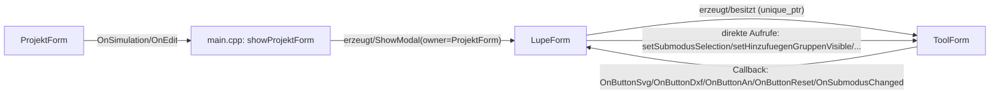

# Analysebericht: Auslagerung des `SidebarPanel` in ein separates `ToolForm`

Reine Analyse, keine Codeänderung vorgenommen. Alle Fundstellen wurden im aktuellen Stand von [lupeform.h](../../lupeform.h), [lupeform.cpp](../../lupeform.cpp), [projektform.h](../../projektform.h), [projektform.cpp](../../projektform.cpp), [main.cpp](../../main.cpp), [AGENTS1.md](../../AGENTS1.md) sowie der externen (lesbar, nicht änderbar) Basisklassen `d:\csharp\CPP\tools\win32form\win32form.h/.cpp`, `dataform.h`, `d:\csharp\CPP\tools\cadform\cadform.h`, `d:\csharp\CPP\tools\timer.h`, `d:\csharp\CPP\tools\kvs.h` geprüft.

---

## 1. Kurzfassung und Empfehlung

`ToolForm` sollte ein eigenständiges, zweites `Win32Form`-abgeleitetes Top-Level-Fenster sein (analog zu `LupeForm`, nicht CAD-basiert), das:

- von `LupeForm` erzeugt, angezeigt, ausgeblendet und zerstört wird (Lebenszyklus-Owner = `LupeForm`),
- **kein** echtes Win32-`WS_EX_TOOLWINDOW`/Owner-Fenster über `CreateWindowEx` erhält, weil die vorhandene Basisklasse dafür keinen Mechanismus bietet (siehe Abschnitt 4/7) — stattdessen wird die Taskleisten-/Alt-Tab-Reduktion, sofern gewünscht, als offene Erweiterung der Basisklasse behandelt (Abschnitt 20),
- über **direkte Methodenaufrufe / `std::function`-Callbacks** bidirektional mit `LupeForm` kommuniziert (kein eigenes Nachrichtenprotokoll nötig, siehe Abschnitt 8),
- **nicht** über `ShowModal()` läuft, sondern nur über `Show()`/`Hide()`, weil die bestehende, thread-weite `GetMessage(nullptr,...)`-Schleife in `LupeForm::ShowModal()` bereits alle Fenster desselben Threads bedient (Abschnitt 4) — ein zweiter verschachtelter `ShowModal()`-Aufruf ist nicht nötig und würde unnötige Komplexität (zwei verschachtelte Message-Loops, zwei Owner-Disable-Zyklen) erzeugen.

Die gemeinsame Modalität gegenüber `ProjektForm` bleibt technisch an `LupeForm::ShowModal(owner)` hängen; `ToolForm` "erbt" die Modalität, indem es nur sichtbar ist, solange `LupeForm` es ist, und spätestens beim `WM_CLOSE`/`WM_DESTROY` von `LupeForm` mitzerstört wird.

**Wichtiger Befund vorab (siehe Abschnitt 4):** Aktuell wird `LupeForm` in [main.cpp](../../main.cpp#L45) und [main.cpp](../../main.cpp#L50) **ohne Owner-Parameter** modal angezeigt (`form.ShowModal();`), wodurch `ProjektForm` beim Öffnen von `LupeForm` gar nicht deaktiviert wird. Das widerspricht bereits heute der Anforderung „solange die modale Einheit aktiv ist, darf `ProjektForm` nicht bedienbar sein“ und muss im Zuge der Umsetzung behoben werden (Owner-Handle mitgeben).

---

## 2. Ist-Zustand

### 2.1 Fensterhierarchie beim Öffnen eines Projekts (Tatsache, [main.cpp](../../main.cpp#L36-L74))

```
showProjektForm()
  ProjektForm projektForm(*fullProjekt)          // erzeugt, noch nicht angezeigt
  projektForm.OnSimulation = [&]{ LupeForm form(*fullProjekt);            form.ShowModal(); }
  projektForm.OnEdit       = [&]{ LupeForm form(*fullProjekt, LupeMode::Edit); form.ShowModal(); }
  projektForm.ShowModal(ownerForm.getFormHandle())   // owner = MainForm/ProjektListForm-Handle
```

`ProjektForm` wird selbst modal gegenüber ihrem Aufrufer (`MainForm` bzw. `ProjektListForm`) angezeigt. Innerhalb der Button-Handler von `ProjektForm` (`OnSimulation`, `OnEdit`) wird `LupeForm` erzeugt und **erneut** `ShowModal()` aufgerufen — verschachtelt, weil dieser Aufruf synchron aus dem `WM_COMMAND`-Zweig der bereits laufenden `ShowModal()`-Schleife von `ProjektForm` erfolgt.

### 2.2 `Win32Form::ShowModal` (Tatsache, `d:\csharp\CPP\tools\win32form\win32form.cpp`)

```cpp
void Win32Form::ShowModal(HWND const owner)
{
    if (owner != NULL) { EnableWindow(owner, false); }
    Show();
    MSG msg;
    while (IsWindow(handle) && GetMessage(&msg, nullptr, 0, 0)) {
        if (!IsDialogMessage(handle, &msg)) {
            TranslateMessage(&msg);
            DispatchMessage(&msg);
        }
    }
    if (owner != NULL) { EnableWindow(owner, true); SetForegroundWindow(owner); }
}
```

Fakten:
- `GetMessage(&msg, nullptr, 0, 0)` filtert **nicht** auf `handle`, sondern liest **alle** Fenster-Nachrichten des aufrufenden Threads. `DispatchMessage` sendet jede Nachricht anhand `msg.hwnd` an das jeweils richtige Fenster (`WndProcStatic` der jeweiligen `Win32Form`-Instanz).
- Die Schleife endet, sobald `handle` kein gültiges Fenster mehr ist (`DestroyWindow` wurde aufgerufen) **oder** `GetMessage` `0`/`-1` liefert (WM_QUIT). `PostQuitMessage` wird im gesamten `Win32Form`-Code nirgends aufgerufen (explizit durch Kommentar ausgeschlossen, siehe `WM_CLOSE`/`WM_DESTROY`-Behandlung), d. h. das Schließen eines Fensters beendet nicht automatisch die Schleife eines anderen.
- `IsDialogMessage(handle, &msg)` wirkt nur auf Nachrichten, die zu `handle` oder dessen Kindfenstern gehören; Nachrichten anderer Top-Level-Fenster durchlaufen normal `TranslateMessage`/`DispatchMessage`.
- `owner` wird nur über `EnableWindow` de-/aktiviert — es gibt **keine** echte Win32-Owner-Beziehung (`GWLP_HWNDPARENT`) und **keinen** echten Parent (`CreateWindowEx` wird in `Win32Form::Win32Form()` immer mit `hWndParent = NULL` aufgerufen, s. u.).

### 2.3 `Win32Form::Win32Form()` (Tatsache)

```cpp
handle = CreateWindowEx(0, classname, text.c_str(), style,
                         0, 0, 500, 600,
                         NULL, /* parenthandle, owner window */
                         NULL, instance, this);
```

Jedes `Win32Form`-Objekt (also auch `ProjektForm`, `LupeForm`, ein künftiges `ToolForm`) ist immer ein eigenständiges Top-Level-Fenster ohne Win32-Owner/Parent. Damit erscheinen alle Fenster grundsätzlich einzeln in Taskleiste/Alt-Tab; "Modalität" und "Zugehörigkeit" werden ausschließlich applikationsseitig durch `EnableWindow` + Message-Loop-Disziplin emuliert, nicht durch das Betriebssystem.

### 2.4 `WM_CLOSE`/`WM_DESTROY` (Tatsache)

```cpp
if (data.message == WM_DESTROY) {
    // hier auf keinen Fall PostQuitMessage aufrufen, das würde die ganze Anwendung beenden
    result.Done = true; return result;
}
if (data.message == WM_CLOSE) {
    closeCanceled = false;
    onClosing.Run();
    if (closeCanceled) { result.Done = true; return result; }
    DestroyWindow(data.handle);
    onClosed.Run();
    result.Done = true; return result;
}
```

`setFormClosing`/`setFormClosed`/`cancelClose()` existieren bereits als Hooks. Schließen ist über `cancelClose()` im `onClosing`-Handler abbrechbar.

### 2.5 Timer (Tatsache, `d:\csharp\CPP\tools\timer.h`)

`estwTimer`/`lupeTimer` in `LupeForm` laufen als eigener `std::thread` mit `sleep_for` — unabhängig von der Fenster-Message-Loop. Das bedeutet: `estwWork()`/`lupeWork()` feuern weiterhin, unabhängig davon, welches Fenster gerade den Message-Pump "aktiv" hat. Für `ToolForm` selbst sind keine Timer vorgesehen.

---

## 3. Betroffene Dateien, Klassen, Methoden und Member

| Datei | Symbol | Relevanz |
|---|---|---|
| [lupeform.h](../../lupeform.h) | Klasse `LupeForm`, Konstanten `NAME_PANEL_RIGHT`, `sidebarWidth`, `sidebarWidthEdit`, `lupeButtonNames`, alle `NAME_LABEL_*`/`NAME_SEGMENT_*`, Methoden `createSidebarPanel`, `createLupeButtons`, `createLupeButton`, `repositionLupeButtons`, `createEditSidebar`, `repositionEditSidebar`, `editSegmentItemWidth`, `submodusChanged`, `updateEditSidebarVisibility`, `LupeEditSubmodus` (enum, privat) | Gesamter auszulagernder UI-Teil |
| [lupeform.cpp](../../lupeform.cpp#L44-L127) | Implementierung der o.g. Methoden; `init()` (Aufrufreihenfolge) | Auslagerungslogik + Reihenfolge |
| [lupeform.cpp](../../lupeform.cpp#L79-L88) | `createLupeButtons()` – erzeugt Buttons "SVG", "DXF", "An", "Reset" | Buttons, die nach `ToolForm` sollen |
| [lupeform.cpp](../../lupeform.cpp#L129-L140), [lupeform.cpp](../../lupeform.cpp#L263-L286) | `button_action4_click` (SVG-Export), `button_action5_click` (DXF-Export), `button_action7_click` (Fahrstraße 100 an/aus), `button_reset_click` (`estwReset()`) | Fachliche Aktionen hinter den Buttons |
| [lupeform.cpp](../../lupeform.cpp#L94-L117) | `createEditSidebar`, `repositionEditSidebar`, `submodusChanged`, `updateEditSidebarVisibility` | Edit-Modus-Controls |
| [lupeform.cpp](../../lupeform.cpp#L153-L179) | `addNeuesElement` (liest `NAME_SEGMENT_*`-Werte aus) | Zustand, der aus den SegmentControls gelesen wird |
| [lupeform.cpp](../../lupeform.cpp#L221-L262) | `createLupeMenu`, `getViewOptionKey`, `readViewOption`, `loadViewOptions`, `saveViewOptions` | Bleiben unverändert in `LupeForm` (Menü, keine Sidebar-Inhalte) |
| [lupeform.cpp](../../lupeform.cpp#L406-L420) | `cadMouseDown` | Nutzt `editSubmodus` (Zustand), bleibt in `LupeForm` |
| [projektform.h](../../projektform.h), [projektform.cpp](../../projektform.cpp) | `OnSimulation`, `OnEdit`, Buttons „Simulation“/„Edit“ | Aufrufer, der `LupeForm` (künftig + `ToolForm`) startet |
| [main.cpp](../../main.cpp#L36-L74) | `showProjektForm()` | Owner-Handling für `ShowModal`, Stelle für Anpassung |
| `d:\csharp\CPP\tools\win32form\win32form.h/.cpp` (extern, nur lesbar) | `Win32Form`, `ShowModal`, `Show`, `Hide`, `Close`, `setFormClosing/Closed`, Control-Fabriken | Basis für `ToolForm`; keine Änderungen ohne Genehmigung |
| `d:\csharp\CPP\tools\cadform\cadform.h` (extern) | `CadForm` (Basis von `LupeForm`) | `ToolForm` sollte **nicht** von `CadForm` erben (keine GDI+/Cad-Fläche nötig), sondern direkt von `Win32Form` (wie `ProjektForm`/`DataForm`) |

---

## 4. Derzeitige modale Logik zwischen `ProjektForm` und `LupeForm`

**Tatsache:** `ProjektForm.ShowModal(ownerForm.getFormHandle())` deaktiviert korrekt seinen eigenen Aufrufer. Die verschachtelten Aufrufe `LupeForm form(...); form.ShowModal();` in [main.cpp](../../main.cpp#L45) und [main.cpp](../../main.cpp#L50) übergeben **keinen Owner** (`ShowModal(HWND owner = 0)` → Default `0`). Damit:

- wird `ProjektForm`s `HWND` **nicht** über `EnableWindow` deaktiviert, während `LupeForm` offen ist;
- läuft `LupeForm`s eigene Message-Loop (thread-weit, s. Abschnitt 2.2) zwar "über" `ProjektForm`s Fenster hinweg, aber weil `ProjektForm` nicht disabled ist, könnte `ProjektForm` theoretisch weiterhin auf Klicks/Fokus reagieren, falls es sichtbar/erreichbar bliebe (es liegt covered hinter `LupeForm`, aber ohne Disable ist das nur eine Frage der Z-Order, nicht der Robustheit).

**Schlussfolgerung (abgeleitet):** Dies ist bereits im heutigen Code eine Lücke gegenüber der Anforderung „`ProjektForm` darf während der modalen Einheit nicht bedienbar sein“. Für die geforderte gemeinsame Modalität aus `LupeForm` **und** `ToolForm` gegenüber `ProjektForm` muss dieser Owner zwingend durchgereicht werden (Empfehlung: `LupeForm` erhält im Konstruktor oder als Parameter zu `ShowModal` das Owner-Handle, `main.cpp` ruft `form.ShowModal(projektForm.getFormHandle())` auf).

**Warum das bestehende `ShowModal` grundsätzlich für die geforderte Zwei-Fenster-Gruppe geeignet ist:** Weil die Message-Loop thread-weit pumpt (`GetMessage(nullptr,...)`) und das Schließen eines Fensters kein `PostQuitMessage` auslöst, kann ein zweites, gleichzeitig sichtbares, nicht-modales Fenster (`ToolForm`, per `Show()`) auf demselben Thread parallel bedient werden, **ohne** dass `LupeForm`s `ShowModal()`-Schleife dafür geändert werden müsste. Die Schleife braucht nicht auf `ToolForm` erweitert zu werden — sie bedient es "kostenlos" mit.

**Restrisiko:** Die Schleife bricht ab, sobald `LupeForm::handle` zerstört wird (`IsWindow(handle)` wird `false`). Wird `LupeForm` geschlossen, während `ToolForm` noch sichtbar ist, muss `ToolForm` explizit synchron mitgeschlossen/zerstört werden **bevor** oder **spätestens innerhalb** des `LupeForm`-Schließvorgangs (z. B. in `LupeForm::~LupeForm()` oder im `onClosing`/`onClosed`-Hook), da sonst nach Ende der Schleife ein verwaistes, nicht mehr bedientes Fenster zurückbleiben könnte (kein Absturz, aber ein „totes“ Fenster ohne Message-Pump-Kontext, sobald der Aufrufer aus `ShowModal()` zurückkehrt und ggf. selbst keine eigene Schleife mehr laufen lässt, falls die Rückkehr das Programm beendet).

---

## 5. Abhängigkeiten der auszulagernden UI-Elemente

### 5.1 Sidebar-Panel selbst

- Erzeugt in `LupeForm::createSidebarPanel(int width)` ([lupeform.cpp](../../lupeform.cpp#L61-L67)): `createPanel(NAME_PANEL_RIGHT)`, rechts angedockt (`DockStyle::Right`), Breite `sidebarWidth` (Simulation) bzw. `sidebarWidthEdit` (Edit).
- Gehört (HWND-technisch) zu `LupeForm` (Kind-Control von dessen `Win32Form::handle`), da über `createPanel`/`createControl` mit `handle` (dem `LupeForm`-Fenster) als `hWndParent` erzeugt.
- Alle Positions-/Größenberechnungen (`repositionLupeButtons`, `repositionEditSidebar`) beziehen sich auf `getControlRect(NAME_PANEL_RIGHT)`, also auf Koordinaten **innerhalb von `LupeForm`**.

### 5.2 Lupe-Buttons (`createLupeButtons`, Simulationsmodus)

| Aspekt | Ist-Zustand |
|---|---|
| Erzeugung | `LupeForm::createLupeButtons()`, ruft 4× `createLupeButton(text, action)` |
| Eigentümer HWND | Kind-Control von `LupeForm::handle` (über `Win32Form::createButton`) |
| Position/Größe | `repositionLupeButtons()` berechnet relativ zu `getControlRect(NAME_PANEL_RIGHT)` (Sidebar-Panel von `LupeForm`) |
| Ereignis | `setFormResize([this]{ repositionLupeButtons(); })` — reagiert auf `LupeForm`s eigenes `WM_SIZE` |
| Ausgelöste Aktion | `button_action4_click` (SVG-Export via `zero->getSvg()`, Zugriff auf `CadForm::zero`), `button_action5_click` (DXF-Export via `DXF dxf; dxf.write(..., zero, ...)`), `button_action7_click` (Zugriff auf `estw.getFahrstrasseById(100)` — `Estw`-Membervariable von `LupeForm`), `button_reset_click` (`estwReset()` → `estw.reset()`) |
| Fachliche Abhängigkeit | Alle vier Aktionen brauchen `LupeForm`-interne Member (`zero` aus `CadForm`, `estw` aus `LupeForm`) → **müssen in `LupeForm` ausgeführt werden**, nicht in `ToolForm` |

### 5.3 Edit-Sidebar (`createEditSidebar`, Edit-Modus)

| Control | Erzeugung | Zustand/Zweck | Nach Klick/Änderung |
|---|---|---|---|
| `NAME_SEGMENT_SUBMODUS` | `createSegmentControl(..., {"Hinzufügen","Verschieben","Drehen","Typ ändern","Unterelementtyp","Löschen"}, 0, ...)` | steuert `LupeForm::editSubmodus` (privates Enum `LupeEditSubmodus`) | `setSegmentControlOnChange` → `submodusChanged(index)` → setzt `editSubmodus`, ruft `updateEditSidebarVisibility()` |
| `NAME_SEGMENT_ELEMENTTYP` | 5 Werte Gleis/Weiche/Signal/Blind/Aufloese | wird nur bei `addNeuesElement()` **gelesen** (`getSegmentControlState`), kein eigener OnChange-Handler | Sichtbarkeit gesteuert über `updateEditSidebarVisibility()` (nur im Untermodus „Hinzufügen“ sichtbar) |
| `NAME_SEGMENT_UNTERELEMENTART` | 3 Werte | wie oben | wie oben |
| `NAME_SEGMENT_ROTATION` | 4 Werte (0°/90°/180°/270°) | wie oben | wie oben |
| `NAME_SEGMENT_MIRROR` | 2 Werte (N/J) | wie oben | wie oben |

Fakt: Nur `NAME_SEGMENT_SUBMODUS` hat einen aktiven Callback (`setSegmentControlOnChange`); die vier „Hinzufügen“-Gruppen werden **passiv** über `getSegmentControlState(...)` erst beim nächsten Mausklick im Gitter (`cadMouseDown` → `addNeuesElement`) ausgelesen — es gibt **keinen** Datenfluss „Segmentwahl → sofortige Aktion“ außer der Sichtbarkeitssteuerung durch den Submodus.

`updateEditSidebarVisibility()` schaltet die Sichtbarkeit von Label/Segment-Paaren um (`setControlVisible`), abhängig von `editSubmodus == LupeEditSubmodus::Hinzufuegen`. `editSubmodus` selbst ist reiner `LupeForm`-Zustand (privates Member), wird aber vom `AGENTS1.md`-Fachkonzept als für alle 6 Untermodi geltend beschrieben (aktuell nur „Hinzufügen“ implementiert, andere Untermodi laut Kommentar in `cadMouseDown` „noch nicht implementiert“).

### 5.4 Positionsberechnung / Layout-Annahmen, die nach Entfernen der Sidebar geändert werden müssten

- `repositionLupeButtons()`/`repositionEditSidebar()` gehen von `getControlRect(NAME_PANEL_RIGHT)` aus — ohne Panel entfällt diese Referenzfläche vollständig.
- `createSidebarPanel(width)` reserviert per `DockStyle::Right` Platz, wodurch das CAD-Gitter (`zero`, via `CadForm`) automatisch schmaler dargestellt wird (Docking-Mechanik in `Win32Form::applyDocking()`, extern). Entfällt das Panel, gewinnt das Gitter automatisch die volle Client-Breite zurück — vorausgesetzt, kein Docked-Control verbleibt rechts.
- `editSegmentItemWidth(count)` rechnet mit `sidebarWidthEdit` als Referenzbreite — müsste bei Auslagerung auf die (unabhängige) Breite von `ToolForm` umgestellt werden.

---

## 6. Bestehende Ereignis- und Zustandsflüsse

Vorhandene Kommunikationsmechanismen im Projekt (Tatsache, keine Vermutung):

1. **`std::function`-Member als Ereignis-Ausgänge** zwischen Fenstern: `ProjektForm::OnSimulation/OnEdit/OnViewElemente/OnViewFahrstrassen` ([projektform.h](../../projektform.h#L18-L21)) — vom Aufrufer (`main.cpp`) gesetzt, von `ProjektForm` intern bei Button-Klick aufgerufen (`if (OnSimulation) { OnSimulation(); }`). Das ist bereits das im Projekt etablierte Muster für **eine Richtung** Kind → Aufrufer.
2. **`tools::Event<T>`** (in `ControlData`, `Win32Form`) — internes Multicast-Delegate für Control-Ereignisse (`OnClick`, `OnSegmentedControlChanged`, …), wird von den `set...Clicked/OnChange`-Methoden der Basisklasse verwendet. Kein fensterübergreifendes Muster, sondern intern je Control.
3. **Direkte Methodenaufrufe** innerhalb eines Fensters (z. B. `submodusChanged` → `updateEditSidebarVisibility`).
4. **Kein** Gebrauch von benutzerdefinierten Windows-Nachrichten (`RegisterWindowMessage`, `WM_APP+n`) im gesamten `Win32Form`/`LupeForm`-Code.
5. **Kein** Observer-/Listener-Interface (reine `std::function`-Callbacks, kein `IObserver` o. Ä.).
6. **Kein** gemeinsames Zustandsobjekt/Controller zwischen zwei gleichzeitig offenen Fenstern (existiert im Projekt noch nicht, da bislang nur ein Fenster gleichzeitig aktiv modal war).

---

## 7. Vergleich der möglichen Fenster- und Ownership-Konzepte

| Kriterium | A: `ToolForm` als echtes Win32-Owned-Window (`GWLP_HWNDPARENT`/`CreateWindowEx`-Owner) | B: `ToolForm` als eigenständiges Top-Level-Fenster, applikationsseitig an `LupeForm`-Lebenszyklus gekoppelt (kein Win32-Owner) | C: `ToolForm` als Kindfenster (`WS_CHILD`) von `LupeForm` |
|---|---|---|---|
| Gleichzeitige Bedienbarkeit | Ja (Owned Windows sind unabhängig eingabefähig) | Ja (Tatsache: thread-weite Message-Loop bedient beide, Abschnitt 4) | Ja, aber an Client-Bereich von `LupeForm` gebunden — widerspricht „frei verschiebbar/überlappend“ |
| Gemeinsame Modalität ggü. `ProjektForm` | Ja, via bestehendes `EnableWindow(owner,...)`-Muster auf `ProjektForm`-Handle, unabhängig von A/B/C | Ja (gleich) | Ja (gleich) |
| Unabhängige Position/Größe | Ja | Ja | Nein (an Parent-Client-Rect gebunden) |
| Taskleiste/Alt-Tab vermeiden | Möglich über `WS_EX_TOOLWINDOW` + Owner — **aber**: `Win32Form`-Konstruktor erlaubt aktuell weder eigenen Extended-Style noch Owner-Handle beim `CreateWindowEx`-Aufruf (private, fest verdrahtet) | Nicht ohne Basisklassen-Erweiterung möglich (gleiche Einschränkung) | Entfällt (kein Top-Level-Fenster) |
| Aufwand/Eingriffstiefe in Basisklasse | Hoch: `Win32Form` müsste um Owner-Parameter/Extended-Style erweitert werden (externe, nur lesbare Datei — Änderung nur nach ausdrücklicher Genehmigung) | Keiner: nutzbar mit der **heutigen** `Win32Form`-API (`Show`, `Hide`, `Close`, `setFormClosing`) | Mittel: Neues Verhalten für „Fenster im Fenster“ nicht vorgesehen |
| Risiko verschachtelter Message-Loops | Gering (kein zusätzliches `ShowModal`) | Gering (kein zusätzliches `ShowModal`, s. Abschnitt 4) | Gering, aber architektonisch unpassend zur Anforderung „frei verschiebbar/überlappend“ |
| Übereinstimmung mit Anforderungen | Technisch ideal, aber aktuell **nicht ohne Änderung der externen, geschützten Basisklasse** umsetzbar | Erfüllt alle funktionalen Anforderungen (Bewegbarkeit, Überlappung, Gleichzeitigkeit, gemeinsame Modalität) mit vorhandenen Mitteln; einzige Einschränkung ist der optionale „kein Taskleisteneintrag“-Wunsch | Erfüllt zentrale Anforderung „unabhängig verschieb-/größenveränderbar“ nicht |

**Empfehlung:** Variante **B**. Sie erfüllt alle harten Anforderungen (gleichzeitige Bedienbarkeit, unabhängige Positionierung/Größe, gemeinsame Modalität via vorhandenes `EnableWindow`-Muster) **ohne** Änderungen an der außerhalb des Workspaces liegenden, nur lesbaren `Win32Form`/`CadForm`-Basis. Der Wunsch „kein Taskleisten-/Alt-Tab-Eintrag“ ist mit der heutigen Basisklasse nicht erreichbar und muss als offene Frage (Abschnitt 20) behandelt werden — er ist laut Aufgabenstellung ohnehin nur „nach Möglichkeit“ gefordert, keine harte Anforderung.

---

## 8. Vergleich der möglichen Kommunikationsmechanismen

| Mechanismus | Kopplung | Lebensdauer-Risiko | Erweiterbarkeit | Testbarkeit | Übereinstimmung mit bestehender Architektur |
|---|---|---|---|---|---|
| Direkte Methodenaufrufe (`toolForm->someMethod()` bzw. `lupeForm->someMethod()`) | Hoch (Header-Abhängigkeit beider Klassen aufeinander) | Mittel (beide Objekte müssen sich kennen und gültig halten) | Gering (jede neue Interaktion = neue Methode + Header-Include) | Mittel | Nicht bisher verwendet zwischen zwei Fenstern |
| **Callbacks / `std::function`** (wie `ProjektForm::OnSimulation`) | Niedrig (nur Signatur, kein Header-Include der Gegenseite nötig) | Gering bis mittel (Lambda-Capture `[this]`/`[&]` muss Lebensdauer beachten — bei Zerstörung von `ToolForm`/`LupeForm` müssen Callbacks vor Zerstörung entfernt oder die Objekte dürfen nicht länger leben als ihre Capture-Referenzen) | Hoch (neue Callback-Member einfach ergänzbar) | Hoch (Callback lässt sich in Tests durch Stub ersetzen) | **Bereits etabliertes Muster im Projekt** (`OnSimulation` etc.) |
| Benutzerdefinierte Windows-Nachrichten (`WM_APP+n`, `PostMessage`) | Niedrig, aber technisch aufwendiger (eigene Message-IDs, `WPARAM`/`LPARAM`-Kodierung) | Gering (HWND-Gültigkeit prüfbar über `IsWindow`) | Mittel (jede neue Nachricht = neue Konstante + Handler-Zweig) | Gering (schwer isoliert zu testen, Windows-Message-Pump nötig) | Nicht verwendet, zusätzlicher Fremdkörper im bestehenden Callback-Stil |
| Observer/Listener-Interface | Niedrig | Mittel (Un-/Registrieren beim Zerstören nötig) | Hoch | Hoch | Nicht vorhanden, wäre Neuerfindung eines im Projekt bereits durch `std::function`/`tools::Event` gelösten Problems |
| Gemeinsames Zustandsobjekt | Mittel (beide Seiten lesen/schreiben denselben State) | Muss Lebensdauer > beider Fenster haben (z. B. `shared_ptr`) | Mittel | Mittel | Nicht vorhanden im Projekt |
| Vermittelnde Controller-Klasse | Niedrig (beide Fenster kennen nur den Controller) | Klar (Controller hält beide Fenster) | Hoch | Hoch | Größerer struktureller Eingriff, aktuell keine Controller-Schicht vorhanden |

**Empfehlung:** `std::function`-Callbacks in beide Richtungen, exakt im bestehenden Stil von `ProjektForm`:

- `ToolForm` → `LupeForm`: `ToolForm` bekommt Callback-Member (z. B. `OnButtonSvg`, `OnButtonDxf`, `OnButtonAn`, `OnButtonReset`, `OnSubmodusChanged(std::size_t)`), die `LupeForm` beim Erzeugen von `ToolForm` setzt und deren Aktionen unverändert in `LupeForm` ausführt (`button_action4_click` etc. bleiben in `LupeForm`).
- `LupeForm` → `ToolForm`: `LupeForm` ruft direkt öffentliche Update-Methoden von `ToolForm` auf (z. B. `toolForm->setSubmodusSelection(index)`, `toolForm->setHinzufuegenGruppenVisible(bool)`), da `LupeForm` den `ToolForm`-Zeiger besitzt (kein Rückweg über Callback nötig — `LupeForm` ist die "Quelle" und kennt `ToolForm` ohnehin als Owner).

Damit bleibt der Kopplungsgrad symmetrisch niedrig: `ToolForm` kennt `LupeForm` nicht als Typ (nur Callback-Signaturen), `LupeForm` kennt `ToolForm` als Typ (weil es dessen Eigentümer ist) — ein klassisches, im Projekt bereits vorgelebtes Owner/Child-Callback-Muster.

---

## 9. Empfohlene Zielarchitektur



- `ProjektForm` unverändert: bleibt Aufrufer, ändert nichts an seiner eigenen Logik.
- `LupeForm`: verliert `createSidebarPanel`, `createLupeButtons`, `createLupeButton`, `repositionLupeButtons`, `createEditSidebar`, `repositionEditSidebar`, `editSegmentItemWidth`, `updateEditSidebarVisibility` (UI-Erzeugung) aus sich selbst heraus, behält aber `editSubmodus` als **maßgeblichen Zustand** und alle fachlichen Handler (`button_action4_click` … `button_reset_click`, `submodusChanged`, `addNeuesElement`). `LupeForm` erzeugt `ToolForm` in `init()`, hält es (z. B. `std::unique_ptr<ToolForm>`), positioniert es initial neben sich, zeigt/verbirgt/zerstört es synchron mit sich selbst.
- Neue Klasse `ToolForm : public Win32Form` (nicht `CadForm`, keine GDI+-Fläche nötig): enthält identische Controls wie bisher im Sidebar-Panel (Buttons + SegmentControls + Labels), jedoch ohne Docking (eigenes Fenster mit fester/eigener Breite), meldet Nutzeraktionen über Callback-Member nach außen, bietet öffentliche Setter für programmatische Aktualisierung von außen.

---

## 10. Gemeinsame Modalität gegenüber `ProjektForm`

- **Verwaltende Komponente:** `LupeForm` bleibt die Komponente, die tatsächlich `ShowModal(owner)` aufruft und damit `ProjektForm` de-/aktiviert. `ToolForm` selbst ruft **niemals** `ShowModal` auf.
- **Voraussetzung (Korrektur nötig):** Owner muss künftig durchgereicht werden — `main.cpp` muss `form.ShowModal(projektForm.getFormHandle())` statt `form.ShowModal()` aufrufen (Behebung der in Abschnitt 4 festgestellten Lücke), sonst bleibt `ProjektForm` während der gesamten `LupeForm`+`ToolForm`-Einheit bedienbar.
- **Warum kein zweites `ShowModal` für `ToolForm`:** Ein zweiter `EnableWindow`/`ShowModal`-Zyklus für `ToolForm` (z. B. mit `owner = LupeForm-Handle`) würde `LupeForm` selbst deaktivieren — das widerspricht der Anforderung „beide Fenster gleichzeitig unabhängig bedienbar“. `ToolForm` wird daher nur mit `Show()`/`Hide()` gesteuert.
- **Reaktivierung von `ProjektForm`:** Erfolgt automatisch am Ende von `LupeForm::ShowModal()` (`EnableWindow(owner, true); SetForegroundWindow(owner);`), **sobald** `LupeForm::handle` zerstört ist. Voraussetzung: `ToolForm` muss zu diesem Zeitpunkt bereits geschlossen/zerstört sein (siehe Abschnitt 11), sonst bleibt ein unkontrolliertes Restfenster offen, während `ProjektForm` schon wieder aktiv ist.

---

## 11. Lebenszyklus und Ownership von `ToolForm`

Geprüfte Optionen (siehe auch Abschnitt 7):

- **`LupeForm` steuert Lebensdauer von `ToolForm` (empfohlen):** `LupeForm::init()` erzeugt `ToolForm` (z. B. als `std::unique_ptr<ToolForm>`-Member), ruft `toolForm->Show()` auf. In `LupeForm`s `onClosing`/Destruktor wird `toolForm->Close()` (bzw. `reset()`) aufgerufen, **bevor** `LupeForm`s eigene `ShowModal`-Schleife endet (Reihenfolge: `WM_CLOSE` von `LupeForm` → im `onClosing`-Handler zuerst `ToolForm` schließen, dann `LupeForm` selbst).
- **Übergeordnete Steuerungskomponente für beide Fenster:** Nicht nötig — würde zusätzliche Klasse ohne Mehrwert einführen, da `LupeForm` bereits als natürlicher Owner fungiert und den fachlichen Zustand (`editSubmodus`, `estw`, `zero`) hält.
- **Ist `ToolForm` ein Owned Window von `LupeForm`?** Technisch (Win32) nein — die Basisklasse bietet dafür keinen Mechanismus (Abschnitt 2.3/7). Semantisch (applikationsseitig) ja: `ToolForm` existiert nur innerhalb der Lebensdauer von `LupeForm`.
- **Schließen von `ToolForm` über eigene Schließen-Schaltfläche:** Empfehlung — **nur Ausblenden** (`Hide()` statt `Close()`), damit „`ToolForm` nur sichtbar, solange `LupeForm` sichtbar“ nicht versehentlich zu einem dauerhaften Verschwinden führt, das der Nutzer nicht mehr rückgängig machen kann (es gibt in `AGENTS1.md`/Aufgabenstellung keinen Hinweis auf einen Reaktivierungsweg für ein einmal schließbares `ToolForm`). Alternative: Schließen von `ToolForm` beendet die gesamte Einheit (auch `LupeForm`) — das ist ebenfalls konsistent mit „`ToolForm` bildet mit `LupeForm` eine Einheit“, aber user-unfreundlicher, da ein versehentlicher Klick auf das X von `ToolForm` die gesamte Simulation/Edit-Sitzung beendet.
  → **Offene fachliche Entscheidung, siehe Abschnitt 20.** Technisch empfehlbar: `ToolForm::setFormClosing([&]{ toolForm->Hide(); toolForm->cancelClose(); })` (Schließen abfangen, nur verstecken).
- **Schließen von `LupeForm`:** `LupeForm::onClosing`/Destruktor muss `ToolForm` aktiv schließen (`Close()`/`DestroyWindow`), damit kein Handle verwaist. Reihenfolge unkritisch bzgl. Absturzgefahr, da `ToolForm` als Objekt-Member von `LupeForm` ohnehin beim Zerstören von `LupeForm` automatisch mitzerstört würde (RAII) — es muss aber **vor** Rückkehr aus `LupeForm::ShowModal()`/Ende der Message-Loop geschehen, was durch Konstruktions-/Destruktionsreihenfolge als Member automatisch sichergestellt ist.
- **Anwendung beenden, während beide Fenster offen sind:** Da kein `PostQuitMessage` verwendet wird, terminiert das Programm nur durch Rückkehr aus `WinMain`/`main`. Für den regulären Fall (`ShowModal`-Kette) ist das unkritisch, solange `LupeForm`s Destruktor `ToolForm` mitzerstört, bevor der Prozess endet.

---

## 12. Bidirektionale Kommunikation zwischen `LupeForm` und `ToolForm`

### 12.1 Interaktionstabelle

| Auslöser | Ereignis/Änderung | Empfänger | Reaktion | Übertragene Daten | Zustandsverantwortung |
|---|---|---|---|---|---|
| Button „SVG“ in `ToolForm` | Klick | `LupeForm` | `button_action4_click()` (SVG-Export) | keine (Signal ohne Payload) | `LupeForm` (`zero`) |
| Button „DXF“ in `ToolForm` | Klick | `LupeForm` | `button_action5_click()` (DXF-Export) | keine | `LupeForm` (`zero`) |
| Button „An“ in `ToolForm` | Klick | `LupeForm` | `button_action7_click()` (Fahrstraße 100 toggeln) | keine | `LupeForm` (`estw`) |
| Button „Reset“ in `ToolForm` | Klick | `LupeForm` | `button_reset_click()` → `estwReset()` | keine | `LupeForm` (`estw`) |
| SegmentControl „Untermodus“ in `ToolForm` (nur Edit-Modus) | Auswahländerung | `LupeForm` | `submodusChanged(index)` setzt `editSubmodus`, ruft intern `updateEditSidebarVisibility()`-Äquivalent | `std::size_t index` | `LupeForm` (`editSubmodus`) |
| `LupeForm` nach `submodusChanged` | Zustandsänderung `editSubmodus` | `ToolForm` | Sichtbarkeit der 4 „Hinzufügen“-Gruppen umschalten | `bool showHinzufuegenGruppen` | `LupeForm` ist Quelle, `ToolForm` nur Darstellung |
| SegmentControls „Elementtyp/Unterelementtyp/Rotation/Mirror“ in `ToolForm` | Auswahländerung (aktuell ohne eigenen Handler) | — | Kein direkter Push nötig; Wert wird von `LupeForm::addNeuesElement()` bei Bedarf abgefragt | — | `ToolForm` (hält den UI-Auswahlzustand selbst, `LupeForm` liest ihn bei Bedarf ab) |
| Mausklick im Gitter (`cadMouseDown` in `LupeForm`, Untermodus „Hinzufügen“) | Neues Element | `LupeForm` liest bei Bedarf `ToolForm`-Segmentwerte | `addNeuesElement(ep)` fragt `toolForm->getElementtypSelection()` usw. ab | `Point ep`, gelesene Segmentwerte | `ToolForm` (UI-Auswahl), `LupeForm` (Fachaktion) |

### 12.2 Vermeidung von Rückkopplungsschleifen

Regel: Programmgesteuerte Aktualisierungen von `ToolForm` (aus `LupeForm` heraus, z. B. `toolForm->setSubmodusSelection(index)`) dürfen **keinen** OnChange-Callback zurück an `LupeForm` auslösen. Die bestehende Basisklasse liefert dafür bereits eine Lösung: `Win32Form::setSegmentControlState(name, index)` löst laut Implementierung (`applySegmentedControlSelection(data, selectedIndex, /*raiseEvent=*/false)`) **kein** `OnSegmentedControlChanged`-Ereignis aus — nur Klicks des Anwenders (`WM_LBUTTONDOWN` im `SegmentedControlWndProc`, `raiseEvent=true`) tun das. Diese vorhandene Unterscheidung „programmatisch vs. Anwenderklick“ auf Ebene der Basisklasse ist der zentrale Baustein, um Endlosschleifen zu vermeiden — `ToolForm` muss lediglich konsequent `setSegmentControlState()` statt eines simulierten Klicks verwenden, wenn es von `LupeForm` aus aktualisiert wird.

---

## 13. Verantwortung und zentrale Quelle der einzelnen Zustände

| Zustand | Quelle (maßgeblich) | Begründung |
|---|---|---|
| `editSubmodus` (`LupeEditSubmodus`) | `LupeForm` (privates Member) | Steuert fachliches Verhalten von `cadMouseDown`; UI in `ToolForm` ist nur Anzeige/Auslöser |
| Aktuelle Auswahl Elementtyp/Unterelementtyp/Rotation/Mirror | `ToolForm` (UI-Zustand der SegmentControls) | Wird aktuell nirgends in `LupeForm` gespiegelt, sondern erst bei Bedarf abgefragt (`getSegmentControlState`) — kann so bleiben: `ToolForm` ist hier alleinige Quelle, `LupeForm` fragt „pull“-artig ab |
| View-Optionen (Element-ID/-Name/Gitter/Frame sichtbar) | `LupeForm` (`kvs`-Persistenz, Menü „Ansicht“) | Bleibt unverändert im Menü von `LupeForm`, nicht Teil der Sidebar-Auslagerung |
| ESTW-Fachzustand (`estw`, `zero`) | `LupeForm` | Bleibt unverändert; `ToolForm` hat keinen eigenen Zugriff darauf |

---

## 14. Fokus-, Aktivierungs- und Z-Order-Verhalten

- Da beide Fenster echte, unabhängige Top-Level-Fenster ohne Win32-Parent/Owner sind (Abschnitt 2.3), unterliegen Fokuswechsel zwischen `LupeForm` und `ToolForm` dem normalen Windows-Verhalten für unabhängige Top-Level-Fenster: Klick auf eines der beiden bringt es in den Vordergrund, ohne das andere zu verdecken oder zu deaktivieren.
- Da kein `EnableWindow` zwischen `LupeForm` und `ToolForm` verwendet wird (nur zwischen `LupeForm` und `ProjektForm`), bleibt `ToolForm` **immer** interaktionsfähig, während `LupeForm` offen ist — konsistent mit der Anforderung „beide Fenster gleichzeitig bedienbar“.
- Minimieren/Wiederherstellen von `LupeForm`: `ToolForm` reagiert darauf nicht automatisch (kein gekoppeltes `WM_SIZE`/`WM_SHOWWINDOW`-Verhalten in der Basisklasse). **Offene Frage:** Soll `ToolForm` beim Minimieren von `LupeForm` ebenfalls minimiert werden? Aktuell keine Kopplung vorhanden; müsste über `setFormResize`/eigene Hooks in `LupeForm` (z. B. Reaktion auf `WM_SIZE` mit `SIZE_MINIMIZED`) ergänzt werden, falls gewünscht.

---

## 15. Unabhängige Positionierung und Größenänderung

- Beide Fenster sind unabhängige `CreateWindowEx`-Fenster; `SetWindowPos`/`setFormPosition`/`setFormSize` eines Fensters beeinflusst das andere nicht (keine geteilten Rects, keine automatische Kopplung im bestehenden Code).
- **Initiale Positionierung:** `LupeForm::init()` kann nach `setFormPosition/-Size` von `LupeForm` (bereits im Konstruktor: `setFormPosition(200,50); setFormSize(1300,900);`) die Position von `ToolForm` relativ dazu berechnen (`getFormRect()` von `LupeForm` abfragen, `ToolForm` rechts daneben platzieren) — einmalig bei Erzeugung, danach keine weitere Bindung (entspricht der Anforderung „sinnvolle Erstpositionierung, aber keine dauerhafte Bindung“).

---

## 16. Migration der bisherigen Inhalte

Empfohlene Schritt-für-Schritt-Migration (rein planerisch):

1. Neue Dateien `toolform.h`/`toolform.cpp`, Klasse `ToolForm : public Win32Form` mit denselben Controls wie bisher im Sidebar-Panel (Buttons + SegmentControls + Labels), aber ohne Docking (eigene Fensterbreite statt `DockStyle::Right`).
2. `ToolForm` erhält öffentliche Callback-Member für die 4 Buttons und das Submodus-SegmentControl sowie öffentliche Setter (`setSubmodusSelection`, `setHinzufuegenGruppenVisible`) für Rückmeldungen aus `LupeForm`.
3. `LupeForm` bekommt ein `std::unique_ptr<ToolForm> toolForm`-Member (oder alternativ zwei Varianten je nach Modus, analog zur heutigen `createSidebarPanel(width)`-Fallunterscheidung).
4. `LupeForm::init()`: statt `createSidebarPanel(...)`+`createLupeButtons()`/`createEditSidebar()` wird `ToolForm` erzeugt, positioniert, angezeigt; Callbacks werden auf die bestehenden `button_action*_click`/`submodusChanged`-Methoden verdrahtet.
5. `addNeuesElement()` liest die 4 Segmentwerte künftig über `toolForm->get...()`-Methoden statt `getSegmentControlState(NAME_SEGMENT_*)` auf sich selbst.
6. `LupeForm`s `onClosing`/Destruktor schließt `ToolForm` mit.
7. Entfernen der nun ungenutzten Member/Methoden aus `LupeForm` (`createSidebarPanel`, `createLupeButtons`, `createLupeButton`, `repositionLupeButtons`, `createEditSidebar`, `repositionEditSidebar`, `editSegmentItemWidth`, `updateEditSidebarVisibility`, `NAME_PANEL_RIGHT`, `sidebarWidth`, `sidebarWidthEdit`, `lupeButtonNames`, alle `NAME_LABEL_*`/`NAME_SEGMENT_*`-Konstanten) — diese wandern strukturell nach `ToolForm`.
8. `main.cpp`: Owner-Parameter bei `form.ShowModal(...)` ergänzen (Behebung der Lücke aus Abschnitt 4).

---

## 17. Konkrete Umsetzungsschritte in sinnvoller Reihenfolge

1. Owner-Weitergabe in `main.cpp` korrigieren (`form.ShowModal(projektForm.getFormHandle())`), unabhängig von `ToolForm` — kleinste, risikoarme Änderung zuerst.
2. `ToolForm`-Grundgerüst erstellen (Fenster, Controls 1:1 aus heutigem Sidebar-Panel, noch ohne Verdrahtung), Sichtprüfung Layout.
3. Callback-Verdrahtung `ToolForm → LupeForm` (Buttons zuerst, da zustandslos/einfach), dann Submodus-SegmentControl.
4. Rückkanal `LupeForm → ToolForm` (Sichtbarkeitssteuerung der Hinzufügen-Gruppen).
5. Umstellung von `addNeuesElement()` auf Lesezugriff über `ToolForm`.
6. Entfernen der alten Sidebar-Erzeugung aus `LupeForm`, Bereinigung nicht mehr benötigter Member/Konstanten.
7. Lebenszyklus-Absicherung (`onClosing`/Destruktor-Reihenfolge, Schließen-Button-Verhalten von `ToolForm`).
8. Manuelle Prüfung gemäß Testplan (Abschnitt 19).

---

## 18. Risiken, Sonderfälle und mögliche Regressionen

- **Owner-Lücke (Abschnitt 4):** Ohne Korrektur bleibt `ProjektForm` während der gesamten `LupeForm`+`ToolForm`-Sitzung theoretisch bedienbar — Regressionsrisiko, falls nicht behoben.
- **Verwaistes `ToolForm`:** Wird `ToolForm` bei Zerstörung von `LupeForm` nicht aktiv geschlossen, bleibt ein Fenster ohne erkennbaren „Besitzer“ übrig, sobald `LupeForm::ShowModal()` zurückkehrt und `ProjektForm` reaktiviert wird.
- **Doppelte SegmentControl-Ereignisse:** Wird versehentlich `setSegmentControlState` durch einen simulierten Klick statt der programmatischen API ersetzt, entsteht eine Rückkopplungsschleife (Abschnitt 12.2) — muss in Code-Reviews geprüft werden.
- **Threading:** `estwTimer`/`lupeTimer` laufen weiterhin unabhängig als Hintergrund-Threads (Abschnitt 2.5); falls künftig `ToolForm`-Inhalte von diesen Timern beeinflusst werden sollen, müsste Thread-Sicherheit separat geprüft werden (aktuell nicht Teil des Sidebar-Umfangs).
- **Taskleisten-/Alt-Tab-Eintrag von `ToolForm`:** Ohne Basisklassen-Erweiterung nicht vermeidbar (Abschnitt 7) — kein technisches Risiko, aber Abweichung vom „nach Möglichkeit“-Wunsch.
- **`IsDialogMessage`-Tab-Navigation:** Da `LupeForm::ShowModal()` `IsDialogMessage(handle, &msg)` nur mit `LupeForm`s eigenem Handle aufruft, greift die dialogtypische Tab-/Mnemonic-Navigation für `ToolForm`-Controls nicht automatisch (kleinere UX-Einschränkung, kein Blocker).

---

## 19. Prüf- und Testplan

Manuell (kein automatisiertes UI-Test-Framework im Projekt erkennbar):

1. `ProjektForm` → „Simulation“ öffnen: `LupeForm` und `ToolForm` erscheinen gleichzeitig, `ProjektForm` reagiert nicht mehr auf Klicks (nach Behebung der Owner-Lücke).
2. Beide Fenster unabhängig verschieben/resizen; keine gegenseitige Beeinflussung von Position/Größe.
3. Fokuswechsel per Klick/Alt-Tab zwischen `LupeForm` und `ToolForm`: beide bleiben bedienbar.
4. Klick auf „SVG“/„DXF“/„An“/„Reset“ in `ToolForm`: löst genau einmal die erwartete Aktion in `LupeForm` aus (Dateien werden geschrieben, Fahrstraßenstatus wechselt, ESTW wird zurückgesetzt) — Kontrolle z. B. über bestehende `std::cout`-Ausgaben.
5. Im Edit-Modus: Wechsel des Untermodus in `ToolForm` → die 4 Hinzufügen-Gruppen werden in `ToolForm` korrekt ein-/ausgeblendet, ohne dass ein Klick in `ToolForm` selbst nochmals einen Submodus-Wechsel auslöst (keine Ereignisschleife, prüfbar durch Zähler/Logging während der Analysephase-Nachfolgeimplementierung).
6. Mehrfacher Wechsel des Untermodus (schnelles Klicken) führt zu keiner Endlosschleife/Flackern.
7. `LupeForm` schließen (X oder Programmende): `ToolForm` verschwindet zuverlässig mit, `ProjektForm` wird wieder aktiv und reagiert wieder auf Eingaben.
8. `ToolForm` über eigene Schließen-Schaltfläche schließen: gemäß getroffener Entscheidung (Abschnitt 11) entweder nur ausblenden oder komplette Einheit beenden — Verhalten muss eindeutig und reproduzierbar sein.
9. Erneutes Öffnen von „Simulation“/„Edit“ nach vorherigem Schließen: `LupeForm` und `ToolForm` sind wieder synchron (Untermodus/Sichtbarkeiten im Ausgangszustand).
10. Minimieren von `LupeForm`: Verhalten von `ToolForm` gemäß getroffener Entscheidung (Abschnitt 14) prüfen.

---

## 20. Offene fachliche oder technische Entscheidungen

1. **Schließen-Button von `ToolForm`:** Nur ausblenden (`Hide()` + `cancelClose()`) oder gesamte modale Einheit beenden? Aus dem vorhandenen Code/den Anforderungen nicht eindeutig ableitbar — Empfehlung: nur ausblenden, mit Wiederanzeige-Möglichkeit über `LupeForm` (z. B. Menüpunkt), sofern gewünscht.
2. **Minimieren-Kopplung:** Soll `ToolForm` beim Minimieren von `LupeForm` automatisch mitminimiert/ausgeblendet werden? Keine bestehende Mechanik dafür vorhanden; müsste bei Bedarf neu ergänzt werden (Reaktion auf `WM_SIZE`/`SIZE_MINIMIZED` via `setFormResize` oder Erweiterung der Basisklasse um einen entsprechenden Hook).
3. **Taskleisten-/Alt-Tab-Unterdrückung für `ToolForm`:** Nicht ohne Erweiterung der außerhalb des Workspaces liegenden, nur lesbaren `Win32Form`-Basisklasse (Owner-Handle/`WS_EX_TOOLWINDOW` bei `CreateWindowEx`) möglich. Erfordert ausdrückliche Genehmigung für eine Änderung an `d:\csharp\CPP\tools\win32form\win32form.h/.cpp`.
4. **Umgang mit den 4 „passiven“ SegmentControls (Elementtyp/Unterelementtyp/Rotation/Mirror):** Sollen sie weiterhin rein „pull“-artig von `LupeForm::addNeuesElement()` abgefragt werden (wie heute), oder soll `ToolForm` bei jeder Änderung aktiv einen Callback an `LupeForm` senden? Aktuell aus dem Code keine Notwendigkeit für „push“ ableitbar, da nur beim tatsächlichen Gitterklick gelesen wird.
5. **Owner-Korrektur (Abschnitt 4) als Voraussetzung:** Muss vor oder zusammen mit der `ToolForm`-Einführung umgesetzt werden — technisch unabhängig von der `SidebarPanel`-Auslagerung, aber fachlich Voraussetzung für „`ProjektForm` darf nicht bedienbar sein“.
