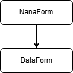

# dbcenter

## Overview

dbcenter ist ein Datenviewer für [mrdb](mrdb.md).

## Fenster-Klassenhierachie

### NanaForm

`NanaForm` ist die Hauptklasse aus der Klassensammlung [NanaForm](nanaform.md) von Mathias Rentsch. Namespace `tools`.

### DataForm

`DataForm` ist eine Ableitung von NanaForm und beinhaltet 3 Panels, sowie 2 Labels. Namespace `tools`.

<small span>
Mathias Rentsch 
rentsch@online.de
</small>
