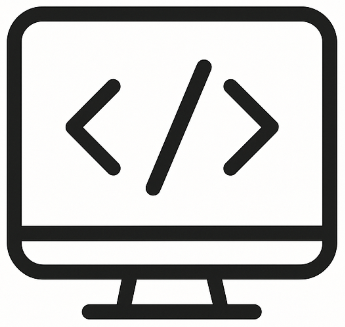

# Entwicklung

## Projekte

- [NanaForm](nanaform.md)
- [MariaDbConnector](maria.md)
- [mrdb](mrdb.md)
- [estw](estw/main.md)
- [cadform](cadform.md)

## Berichte

- [Bericht 1: Analyse der Datenstruktur maria.h](bericht1.md)
- [Bericht 2: Analyse der Klasse tools::Field](bericht2.md)
- [Bericht 3: Analyse Edit-Modus LupeForm + MariaDB-Persistierung](bericht3.md)
- [Bericht 4: Analyse Auslagerung des `SidebarPanel` in ein separates `ToolForm`](bericht4.md)
- [Bericht 5: Analyse Erweiterung SegmentControls](bericht5.md)

<small span>
Mathias Rentsch 
rentsch@online.de
</small>

