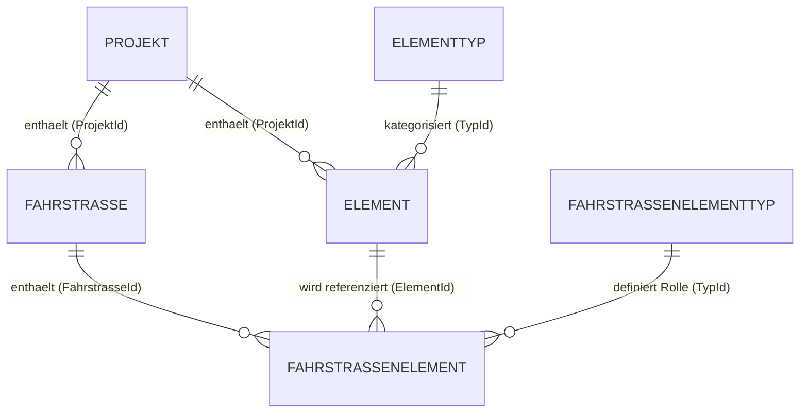
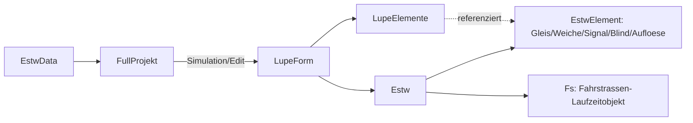

# estw3 – Fachliche Wissensgrundlage

Dieses Dokument beschreibt die zentralen fachlichen Begriffe, Datenstrukturen, Zusammenhänge und Funktionen von `estw3`. Es richtet sich an KI-Agenten und Menschen, die sich schnell und verlässlich in die Fachlichkeit des Programms einarbeiten müssen.

Kennzeichnung im Text:
- Aussagen ohne besonderen Hinweis sind direkt aus Code oder vorhandener Dokumentation belegt.
- **Annahme:** kennzeichnet eine plausible, aber nicht vollständig belegte Ableitung.
- **Offener Klärungspunkt:** kennzeichnet einen Widerspruch oder eine Lücke, die nicht eindeutig aufgelöst werden konnte.

## 1. Überblick über estw3

`estw3` bildet ein **Elektronisches Stellwerk (ESTW)** ab, also die Steuerung und Sicherung von Gleisanlagen (Fahrstraßen, Weichen, Signale) einer Modell- bzw. Simulationsbahnanlage. Das Programm hat zwei fachliche Ebenen:

1. **Verwaltungsebene (Stammdaten):** Projekte, Elemente, Elementtypen, Fahrstrassen, Fahrstrassenelementtypen und Fahrstrassenelemente werden als Stammdaten verwaltet, wahlweise aus lokalen CSV-Dateien, aus einer MariaDB-Datenbank, aus mrdb oder aus fest im Code hinterlegten Testdaten geladen (`generate_estw_data` in [aktionen.cpp](../aktionen.cpp)). Über das `MainForm` lassen sich diese Stammdaten in Listenformularen (`EstwListForm`, `ProjektListForm`) sichten.
2. **Betriebsebene (Simulation/Bearbeitung):** Für ein einzelnes Projekt (`FullProjekt`) kann das `LupeForm` geöffnet werden. Es stellt die Elemente eines Bahnhofs grafisch auf einem Gitterraster dar (Lupenbild). Vorgesehen sind folgende Betriebsarten:
   - **Simulation:** Die eigentliche ESTW-Logik läuft (Belegung, Weichenstellung, Signalstellung, Fahrstraßenbildung, Flankenschutz usw.).
   - **Edit:** Elemente können hinzugefügt, verschoben, gedreht, gespiegelt, im Typ geändert oder gelöscht werden. Änderungen werden zunächst nur im Formular gehalten und erst bei Bestätigung persistiert (siehe Abschnitt 3.7).
   - **FahrstrassenEdit:** In diesem Modus können Fahrstrassen angelegt und gelöscht sowie ihre FahrstrassenElemente bearbeitet werden. Dazu wird eine Fahrstrasse ausgewählt und den Elementen der Topologie im `LupeForm` ein FahrstrassenElementtyp zugewiesen oder eine bestehende Zuordnung wieder entzogen.

Die wesentlichen fachlichen Zusammenhänge:
- Ein **Projekt** ist die oberste Organisationseinheit (z. B. ein Bahnhof/eine Anlage) und besitzt eigene **Elemente** und **Fahrstrassen**.
- Ein **Element** ist ein einzelnes Stellwerksobjekt (Gleis, Weiche, Signal, Blindziel oder Auflöseelement) mit einer festen Position im Lupenraster.
- Eine **Fahrstrasse** verknüpft mehrere Elemente eines Projekts über **Fahrstrassenelemente** zu einem gesicherten Fahrweg zwischen einem Start- und einem Zielsignal.
- **Elementtypen** und **Fahrstrassenelementtypen** sind feste, in der Datenbank gepflegte Kategorien, die die Bedeutung eines Elements bzw. seiner Rolle innerhalb einer Fahrstrasse festlegen.

## 2. Zentrale Begriffe und Datenstrukturen

Die maßgeblichen Datentypen sind in [structs.h](../structs.h) definiert; diese Datei ist laut [rules_isvalid_estwdata.md](rules_isvalid_estwdata.md) die verbindliche Quelle für Feldnamen und -typen.

### 2.1 Projekt

Fachliche Bedeutung: Eine einzelne Stellwerksanlage bzw. ein einzelner Bahnhof, der unabhängig von anderen Projekten verwaltet wird.

Felder (`struct Projekt`, [structs.h](../structs.h)):
- `Id` – eindeutiger Schlüssel, wird von `Element.ProjektId` und `Fahrstrasse.ProjektId` referenziert.
- `Bezeichnung` – Name des Projekts (Pflichtfeld).
- `Beschreibung` – optionaler erläuternder Text.

Beziehungen: Ein Projekt besitzt 0..n `Element` und 0..n `Fahrstrasse`. Die Zusammenfassung aller zu einem Projekt gehörenden Daten erfolgt im abgeleiteten Typ `FullProjekt` (siehe 2.7).

Verwendungszweck: Auswahl- und Organisationseinheit in `ProjektListForm`/`ProjektForm`; einziger Container, der dem `LupeForm` als Ganzes übergeben wird.

### 2.2 Elementtyp

Fachliche Bedeutung: Fest definierte Kategorie, der ein Element angehört (Gleis, Weiche, Signal, Blindziel, Auflöseelement oder Test). Die Katalogdaten werden als Datenbankeinträge verwaltet; ihre stabilen IDs sind zusätzlich zentral durch `ElementTypId` in [structs.h](../structs.h) benannt ([datenstrukturen.md](datenstrukturen.md)).

Felder (`struct Elementtyp`, [structs.h](../structs.h)): `Id`, `Bezeichnung`, `Beschreibung`.

Feste Werte laut Dokumentation. Die fachliche Identifikation erfolgt anhand der stabilen `ElementTypId`; `Bezeichnung` enthält die Langform und dient nicht als Grundlage fachlicher Verzweigungen:

|ElementTypId|Bezeichnung|
|-|-|
|1|Gleis|
|2|Weiche|
|3|Signal|
|4|Blindziel|
|5|Auflöseelement|
|99|Test|

Beziehung zum Laufzeitmodell (Abschnitt 2.9): Gleis, Weiche und Signal sind eigene Laufzeitklassen; Blindziel und Auflöseelement sind im Code Unterklassen von `Gleis` ([blind.h](../estw/blind.h), [aufloese.h](../estw/aufloese.h)), obwohl sie im Datenmodell als eigenständige Elementtypen geführt werden. **Annahme:** Für den Elementtyp Test (`ElementTypId = 99`) wurde im untersuchten Code keine eigene Laufzeitklasse gefunden; seine genaue fachliche Verwendung ist ein **offener Klärungspunkt**.

#### Stränge und Gleismelder

Die Stränge beschreiben die fachlichen Anschlusspunkte eines Elements. Die Zuordnung der Stränge und Gleismelder ist für die Elementtypen wie folgt festgelegt:

- **Gleis, Auflöseelement und Blindziel:** Das Element besitzt **Strang A** und **Strang B**. Es besitzt genau **einen Gleismelder**, der sich durchgehend von Strang A bis Strang B erstreckt.
- **Signal:** Das Element besitzt **Strang A** und **Strang B** sowie genau **zwei Gleismelder**. **Melder A** erstreckt sich von Strang A bis zur Mitte des Elements, **Melder B** von der Mitte des Elements bis Strang B.
- **Weiche:** Das Element besitzt genau **drei Stränge**. **Strang A** befindet sich an der Spitze der Weiche, **Strang B** ist der rechte Strang und **Strang C** der linke Strang. Diese Zuordnung ist unabhängig davon, welcher der beiden Stränge B oder C der gerade beziehungsweise der abzweigende Strang ist.

Diese Zuordnung ist fachlich verbindlich und bei Topologie, Belegungslogik und grafischer Darstellung der Elemente zu berücksichtigen.

### 2.3 Element

Fachliche Bedeutung: Ein einzelnes, im Lupenraster eines Projekts platziertes Stellwerksobjekt (z. B. ein Gleisabschnitt, eine Weiche, ein Signal).

Felder (`struct Element`, [structs.h](../structs.h)):
- `Id` – eindeutiger Schlüssel, wird von `FahrstrassenElement.ElementId` referenziert.
- `Bezeichnung` / `Beschreibung` – Name bzw. erläuternder Text.
- `ProjektId` – Zugehörigkeit zu einem `Projekt`.
- `TypId` – Referenz auf `Elementtyp`; bestimmt die fachliche Grundart des Elements.
- `UnterElementArt` – bildliche und fachliche Differenzierung eines Elements innerhalb seines Elementtyps (laut Dokumentation Werte 1–3, siehe auch [editmodus.md](editmodus.md)). Für den Elementtyp **Gleis** ist `UnterElementArt = 3` als **Prellbock** festgelegt. Ein Prellbock bleibt fachlich ein Gleis und besitzt deshalb wie ein Gleis Strang A und Strang B sowie einen durchgehenden Gleismelder; seine besondere Bedeutung ist in der grafischen Darstellung als Prellbock erkennbar. Für den Elementtyp **Signal** legt [signale.md](signale.md#signalarten-nach-unterelementart) `UnterElementArt = 1` als Hauptsignal und `UnterElementArt = 2` als Rangiersignal fest. Die konkrete Bedeutung der Werte von `UnterElementArt` ist für die übrigen Elementtypen noch nicht vollständig dokumentiert.
- `Lupe1X`, `Lupe1Y` – Position im Bildschirmraster der Lupenansicht.
- `Rotation` – Drehwinkel (0 = 0°, 1 = 90°, 2 = 180°, 3 = 270°).
- `Mirror` – Angabe, ob das Element gespiegelt dargestellt wird.
- Programmfall-Flags `PR`, `PZ`, `PRS`, `PRZ`, `PZS`, `PZZ`, `PSSL`, `PSSR`, `PZSP` – siehe unten.

#### Programmfälle (Element-Flags)

Die Programmfall-Flags legen fest, welche fachlichen Rollen ein Element einnehmen darf. Sie sind nur für bestimmte Elementtypen sinnvoll (siehe Tabelle in [datenstrukturen.md](datenstrukturen.md), Abschnitt „Programmfälle“):

|Kürzel|Bedeutung|Zutreffend bei Typ|
|-|-|-|
|PR|Rangierstraße zulässig (muss bei der Zulassungsprüfung an jedem der Rangierstrasse zugeordneten Fahrstrassenelement gesetzt sein, dessen referenziertes Element vom Elementtyp Gleis ist)|Gleis|
|PZ|Zugstraße zulässig|Gleis|
|PRS|Rangierstraßenstart zulässig|Signal|
|PRZ|Rangierstraßenziel zulässig|Signal, Blindziel|
|PZS|Zugstraßenstart zulässig|Signal|
|PZZ|Zugstraßenziel zulässig|Signal, Blindziel|
|PSSL|Umstellsperre links (Weiche in Stellung Links verriegelt)|Weiche|
|PSSR|Umstellsperre rechts (Weiche in Stellung Rechts verriegelt)|Weiche|
|PZSP|Zielsperre (bei gesetztem `PZSP` darf ein Signal nicht gleichzeitig Ziel einer Rangierstrasse und Flankenschutzelement einer Zugstrasse sein; die Zulassungsprüfung der Rangierstrasse ist negativ, wenn genau ihr Zielsignal aktuell so als Flankenschutzelement verwendet wird)|Signal|

Diese Flags entsprechen im Laufzeitmodell den `Get...`-Methoden der jeweiligen Klassen, z. B. `Signal::GetPRS()`, `Signal::GetPZZ()`, `Weiche::GetPSSL()` ([signal.h](../estw/signal.h), [weiche.h](../estw/weiche.h)).

#### Mögliche Projektierungen

Die Tabelle „Mögliche Projektierungen“ in [datenstrukturen.md](datenstrukturen.md) listet gültige Kombinationen aus Elementtyp, `UnterElementArt`, `Rotation` und `Mirror`. Sie definiert, welche Kombinationen beim Anlegen eines Elements (Editmodus, Untermodus „Hinzufügen“) tatsächlich zulässig sind.

Beziehungen: `ProjektId → Projekt.Id`, `TypId → Elementtyp.Id`. Fachliche Invarianten sind in [rules_isvalid_estwdata.md](rules_isvalid_estwdata.md) festgelegt, u. a. Eindeutigkeit von `Bezeichnung` je Projekt/Typ und Eindeutigkeit der Rasterposition (`Lupe1X`/`Lupe1Y`) je Projekt.

### 2.4 Fahrstrasse

Fachliche Bedeutung: Ein gesicherter Fahrweg zwischen einem Startsignal und einem Zielsignal/-blindziel innerhalb eines Projekts, entweder als Rangier- oder als Zugstraße.

Felder (`struct Fahrstrasse`, [structs.h](../structs.h)): `Id`, `ProjektId` (Referenz auf `Projekt`), `TypId` (1 = Rangierstrasse, 2 = Zugstrasse), `Bezeichnung`, `Beschreibung`, sowie die Liste `Fahrstrassenelemente` (die zugehörigen `FahrstrassenElement`-Einträge).

Invarianten (laut [rules_isvalid_estwdata.md](rules_isvalid_estwdata.md)): `Bezeichnung` ist je Projekt eindeutig; eine Fahrstrasse muss genau ein Start-, genau ein Ziel- und genau ein Auflöseelement besitzen sowie höchstens ein Vorwegelement (siehe 2.6).

Die **allgemein gültige Fahrstraßenlogik**, insbesondere die Bedeutung des Status, das Einschalten, die einmalige Zulassungsprüfung, die zyklische Prüfung der Voraussetzungen für Statuswerte größer 1 sowie die Reaktion auf weggefallene Voraussetzungen, ist in [fahrstrasse.md](fahrstrasse.md) beschrieben.

Die typabhängigen Abläufe und Bedingungen sind getrennt dokumentiert:

- [rangierstrasse.md](rangierstrasse.md) – Rangierstraßen
- [zugstrasse.md](zugstrasse.md) – Zugstraßen

### 2.5 Fahrstrassenelementtyp

Fachliche Bedeutung: Feste Kategorie, die die **Rolle** eines Elements innerhalb einer Fahrstrasse beschreibt (analog zu Elementtyp, aber bezogen auf Fahrstrassen statt auf Projekte). Auch diese Kategorien sind fest in der Datenbank hinterlegte, kaum veränderliche Einträge.

Felder (`struct FahrstrassenElementtyp`, [structs.h](../structs.h)): `Id`, `Bezeichnung`, `Beschreibung`.

**Annahme** (abgeleitet aus [rules_isvalid_estwdata.md](rules_isvalid_estwdata.md) und den Rollen in `FsInitData`, [fs.h](../estw/fs.h)): Die numerischen `Id`-Werte entsprechen vermutlich folgenden Rollen; eine autoritative Wertetabelle wie bei `Elementtyp` liegt nicht vor:

|Id (angenommen)|Rolle|Bedeutung|
|-|-|-|
|1|Fahrwegelement|Element, das im Sinne der Fahrstrecke direkt befahren wird. Im Status Beanspruchung wird es blau oder grün ausgeleuchtet.|
|2|Fahrstrassenstart|Startpunkt einer Fahrstrasse|
|3|Fahrstrassenziel|Zielpunkt einer Fahrstrasse|
|4|Auflöseelement|Element zur Auflösung einer Fahrstrasse|
|5|Flankenschutzelement|Element, das Flankenschutz bietet|
|6|Vorwegelement|Der Fahrstrasse zugeordnetes Vorwegelement|
|7|Unterwegselement|Unterwegs liegendes Element mit einer besonderen Funktion innerhalb der Fahrstrasse|
|8|Flankenschutztransportelement|Element im Flankenschutzraum, das frei sein muss|

Welche Rollen einem Element aufgrund seines Elementtyps zugewiesen werden dürfen, ist verbindlich in der Zuordnungstabelle in [datenstrukturen.md](datenstrukturen.md#zulässige-zuordnungen-zu-elementtypen) festgelegt.

Dies ist ein **offener Klärungspunkt**: Die konkreten `Id`-Werte sollten anhand der tatsächlichen Datenbankinhalte verifiziert werden.

### 2.6 Fahrstrassenelement

Fachliche Bedeutung: Verknüpft ein `Element` mit einer `Fahrstrasse` und legt fest, welche Rolle (`Fahrstrassenelementtyp`) das Element in dieser Fahrstrasse einnimmt und welche Stellung es dafür einnehmen muss.

Felder (`struct FahrstrassenElement`, [structs.h](../structs.h)):
- `Id` – eindeutiger Schlüssel.
- `FahrstrasseId` – Referenz auf `Fahrstrasse`.
- `ElementId` – Referenz auf `Element`.
- `TypId` – Referenz auf `Fahrstrassenelementtyp` (Rolle, siehe 2.5).
- `SollStellung` – die für das Element in dieser Fahrstrasse projektierte Sollstellung. Die Bedeutung hängt vom Elementtyp ab:
  - **Weichen:** Der Wert entspricht der für die Fahrstrasse benötigten Weichenstellung: `-1` = links, `1` = rechts. Die Weiche muss diese Stellung für die Fahrstrasse einnehmen.
  - **Signale:** Der Wert wird am **Startsignal** als `hvs` (Hauptsignalgeschwindigkeit) beziehungsweise als Signalstellung gesetzt, sobald das entsprechende Sicherungsniveau der Fahrstrasse erreicht ist. Wertebereich und fahrstraßenabhängige Bedeutung sind verbindlich in [signale.md](signale.md#hauptsignalgeschwindigkeit) festgelegt.

Invarianten: Die Kombination aus `FahrstrasseId` und `ElementId` ist eindeutig; die `ProjektId` des referenzierten Elements muss mit der `ProjektId` der referenzierten Fahrstrasse übereinstimmen ([rules_isvalid_estwdata.md](rules_isvalid_estwdata.md)).

### 2.7 FullProjekt und EstwData

`FullProjekt` (`struct FullProjekt final : public Projekt`, [structs.h](../structs.h)) erweitert `Projekt` um die zugehörigen Container `Elemente` (alle Elemente dieses Projekts) und `Fahrstrassen` (alle Fahrstrassen dieses Projekts, jeweils bereits mit ihren `Fahrstrassenelemente` gefüllt). `FullProjekt` ist nicht kopierbar (nur verschiebbar), um teure Kopien der enthaltenen Container zu vermeiden.

`EstwData` (`struct EstwData final`) ist der Gesamtzustand der Anwendung nach dem Laden: alle `Projekte`, `Elementtypen`, `Elemente`, `Fahrstrassen`, `Fahrstrassenelementtypen`, `Fahrstrassenelemente` sowie die daraus abgeleitete Liste `FullProjekte`. `generate_fullprojekte` ([aktionen.cpp](../aktionen.cpp)) baut `FullProjekte` aus den flachen Listen auf, indem es Elemente und Fahrstrassen ihrem Projekt zuordnet und Fahrstrassenelemente ihrer Fahrstrasse zuordnet.

Verwendungszweck: `EstwData` ist der zentrale In-Memory-Datenbestand, mit dem `MainForm` und alle darüber geöffneten Listen-/Detailformulare arbeiten ([main.cpp](../main.cpp)).

### 2.8 ConfigData / DataSource

`ConfigData` (`struct ConfigData final`, [structs.h](../structs.h)) beschreibt, woher die Stammdaten geladen werden:
- `DataSource` – Enum mit den Werten `LocalCsv`, `MariaDB`, `Test` und `Mrdb`.
- `Connection` (`ConnectionData`) – Zugangsdaten für MariaDB (Host, Port, Database, User, Password).
- `LocalCsv` (`LocalCsvData`) – Pfad zu lokalen CSV-Dateien.

Fachliche Bedeutung: Steuert zur Laufzeit, ob Daten aus CSV-Dateien, aus einer MariaDB-Datenbank oder aus fest hinterlegten Testdaten stammen ([generate_estw_data](../aktionen.cpp)). Die Einstellung wird über das `ConfigForm` bearbeitet und im Key-Value-Store persistiert ([main.cpp](../main.cpp), [lademechanismus_daten.md](lademechanismus_daten.md)). Schreibender Zugriff (Editmodus, Speichern von Elementänderungen) ist laut Code ausschließlich bei `DataSource::MariaDB` möglich ([main.cpp](../main.cpp), [elementpersistence.h](../elementpersistence.h)).

### 2.9 Laufzeitmodell: Estw, EstwElement und Fahrstraßen-Laufzeitobjekt (Fs)

Für die **Simulation** eines Projekts im `LupeForm` werden die Stammdaten (`Element`, `Fahrstrasse`) in Laufzeitobjekte überführt:

- **`Estw`** ([estw.h](../estw/estw.h)) ist der Container für alle Laufzeitelemente (`EstwElemente`) und Fahrstraßen-Laufzeitobjekte (`Fahrstrassen`) eines Projekts. Er bietet `work()` (einen Simulationsschritt ausführen), `reset()` sowie Suchfunktionen nach Id und Typ.
- **`EstwElement`** ([element.h](../estw/element.h)) ist die gemeinsame Basisklasse aller Stellwerkselemente. Sie verwaltet u. a. `besetzt` (Gleisbelegung) und `sperre` (Befahrbarkeitssperre) und deklariert `work()` als rein virtuelle Methode (jede konkrete Elementart hat eigene fachliche Ablauflogik).
  - **`Gleis`** ([gleis.h](../estw/gleis.h)): Basisverhalten für Gleisabschnitte, u. a. Beanspruchung durch Rangier-/Zugstraße (`BEA_t`).
  - **`Blind`** ([blind.h](../estw/blind.h)) und **`Aufloese`** ([aufloese.h](../estw/aufloese.h)) erben von `Gleis` und ergänzen jeweils eigene Programmfälle bzw. Zustände (z. B. `ZIF_t` Zielfestlegemelder bei `Blind`, Auflösebereichsanzeige `FAUF` bei `Aufloese`).
  - **`Weiche`** ([weiche.h](../estw/weiche.h)): bildet Zungenstellung, Motorlauf, Verschluss, Umstellsperre und Auffahren einer Weiche ab (`WeicheStellung`: `None`/`Links`/`Rechts`).
  - **`Signal`** ([signal.h](../estw/signal.h)): bildet Signalbegriffe/-zustände ab (Haupt-/Vorsignalgeschwindigkeit gemäß [signale.md](signale.md), Ersatzsignal `ZS1`, Wiederholungssperre `WSP`, Signalsperre `FSS`, Beanspruchung auf zwei Strängen `BEAA`/`BEAB`, Flankenschutzbeanspruchung `BEAF`, Festlegemelder `FUEM`, Zielfestlegemelder `ZIF`).
- **`Fs`** ([fs.h](../estw/fs.h)) ist das Laufzeitobjekt einer Fahrstrasse. Es hält eine Kopie der Stammdaten (`Fahrstrasse`) sowie `FsInitData`, welche die beteiligten Elemente nach fachlicher Rolle referenziert: `startSignal` (Typ 2), `zielElement` (Typ 3, als `ZielElement` – kapselt wahlweise `Signal` oder `Blind`), `aufloeseElement` (Typ 4), `vorwegElement` (Typ 6), sowie Listen für normale Fahrwegelemente (Typ 1), Unterwegselemente (Typ 7), flankenschutzbietende Elemente (Typ 5) und Flankenschutztransportelemente (Typ 8). `Fs::work()` prüft laufend, ob die Fahrstrasse fachlich noch gültig ist (`isValid()`), und verwaltet den Zustand `an` (Fahrstrasse eingestellt/aufgeschaltet).

Gemeinsame Basis für Logging: `LogElement` ([logelement.h](../estw/logelement.h)) stellt Name und eine geschützte `log()`-Methode bereit und wird sowohl von `EstwElement` als auch von `Fs` und der Lupe-Elementfamilie genutzt.

### 2.10 Visuelles Modell: LupeElement-Familie

Die grafische Darstellung eines Elements im Lupenraster ist von seiner Simulationslogik getrennt: **`LupeElement`** ([lupeelement.h](../lupe/lupeelement.h)) und seine Ableitungen `LupeGleis`, `LupeWeiche`, `LupeSignal`, `LupeBlind`, `LupeAufloese` kapseln die CAD-Darstellung (Position `EP`, Rotation, Spiegelung, Markierung, Sichtbarkeit von ID/Name, Kontextmenü) und halten intern eine Referenz auf das zugehörige `EstwElement` (`PEstwElement`). Diese Trennung erlaubt es, dieselbe Laufzeitlogik unabhängig von der konkreten Bildschirmdarstellung zu betreiben.

Für den Melder `LupeAufloese::melder_auf` eines Auflöseelements gelten abhängig vom Modus folgende Sichtbarkeitsregeln:

| Modus | Sichtbarkeit von `melder_auf` |
|---|---|
| Simulation | Sichtbar, wenn mindestens eine angeschaltete Fahrstrasse das dargestellte Element über ein FahrstrassenElement mit `TypId = 4` als Auflöseelement verwendet. Maßgeblich ist der vorhandene Zustand `Fs::getAn()` der Fahrstrasse. Ohne passende Zuordnung oder angeschaltete passende Fahrstrasse ist der Melder unsichtbar. |
| Edit | Für jedes dargestellte Auflöseelement immer sichtbar, unabhängig von Fahrstrassenzuordnungen. |
| FahrstrassenEdit | Für jedes dargestellte Auflöseelement immer sichtbar, unabhängig von der ausgewählten Fahrstrasse, dem ausgewählten FahrstrassenElementtyp und den fahrstrassenbezogenen Bearbeitungsmarkierungen. |

Bei mehreren passenden Fahrstrassen genügt im Simulationsmodus eine angeschaltete Fahrstrasse. Wird die letzte passende Fahrstrasse ausgeschaltet beziehungsweise aufgelöst, wird `melder_auf` wieder ausgeblendet.

## 3. Zentrale Programmfunktionen

### 3.1 Datenquelle konfigurieren (Setup)

Über `ConfigForm` wird `ConfigData` bearbeitet und geprüft (inkl. Verbindungstest zu MariaDB, `test_mariadb_connection`, [aktionen.h](../aktionen.h)). Die Konfiguration wird über einen Key-Value-Store dauerhaft gespeichert ([main.cpp](../main.cpp)). Laut [lademechanismus_daten.md](lademechanismus_daten.md) werden beim Programmstart noch keine Daten geladen (`isDataLoaded`); erst beim ersten benötigten Button-Klick werden sie entsprechend der aktuellen `DataSource` geladen. Ein erneuter Aufruf von Setup mit geänderter `DataSource` setzt diesen Ladezustand zurück.

### 3.2 Laden der Daten

`generate_estw_data(ConfigData const &, ec_t &)` ([aktionen.cpp](../aktionen.cpp)) lädt, abhängig von `DataSource`, alle Stammdaten entweder aus CSV-Dateien, aus MariaDB oder erzeugt feste Testdaten, baut anschließend `FullProjekte` auf (`generate_fullprojekte`) und führt die Validierung (`isvalid_estwdata`) aus. Fehler und Hinweise beim Einlesen (z. B. leere Pflichtfelder, ungültige Zahlen-/Boolean-Werte) werden über den `ec_t`/`MessageCollector` gesammelt.

### 3.3 Validierung

`isvalid_estwdata(EstwData const&, ec_t&) -> bool` ([validate.h](../validate.h)/[validate.cpp](../validate.cpp)) prüft die Konsistenz aller geladenen Stammdaten gemäß den in [rules_isvalid_estwdata.md](rules_isvalid_estwdata.md) festgelegten Regeln, u. a.:
- Pflichtfelder und Eindeutigkeit von Bezeichnungen/IDs je Tabelle,
- Gültigkeit von Fremdschlüsseln (`ProjektId`, `TypId`, `FahrstrasseId`, `ElementId`),
- Gültigkeit von Wertebereichen (`Rotation` ∈ {0,1,2,3}, `UnterElementArt` ∈ {1,2,3}, Fahrstraßentyp ∈ {1,2}),
- fachliche Konsistenz je Fahrstrasse (genau ein Start-, ein Ziel- und ein Auflöseelement, passender Elementtyp des jeweils referenzierten Elements, höchstens ein Vorwegelement).

Gefundene Fehler werden mit Typangabe und Id in den `ec_t`/`MessageCollector` geschrieben; die Funktion liefert `true`, wenn keine Fehler aufgetreten sind.

### 3.4 Projekt- und Stammdatenverwaltung

`MainForm` bietet Buttons für Projekte, Elemente, Elementtypen, Fahrstrassen, Fahrstrassenelemente und Fahrstrassenelementtypen sowie Setup und Info ([mainform.cpp](../mainform.cpp)). Die zugehörigen Klickbehandlungen in [main.cpp](../main.cpp) wandeln die jeweiligen Stammdaten über `convert_*_to_listviewdata` ([converts.h](../converts.h)) in Listenansichten um und zeigen sie über `EstwListForm` an. `ProjektListForm` listet Projekte und öffnet per Doppelklick ein `ProjektForm`, das Kennzahlen zum Projekt anzeigt und Zugriff auf Simulation, Edit-Modus sowie die projektbezogenen Elemente-/Fahrstrassen-Listen bietet.

### 3.5 Simulation

Aus `ProjektForm` heraus öffnet `OnSimulation` ein `LupeForm` im `LupeMode::Simulation` für das gewählte `FullProjekt`. Intern baut `LupeForm::estwInit` daraus die Laufzeitobjekte (`Estw`, `EstwElement`-Ableitungen, `Fs`) auf; ein Timer (`estwTimer`) treibt wiederkehrend `Estw::work()` an, ein zweiter Timer (`lupeTimer`) aktualisiert die grafische Darstellung (`lupeWork()`).

### 3.6 Bearbeiten von Elementen (Editmodus)

Der Editmodus ist laut [main.cpp](../main.cpp) nur verfügbar, wenn `DataSource::MariaDB` aktiv ist. `LupeForm` wird dann mit `LupeMode::Edit` und einem `SaveElementsCallback` erzeugt. Innerhalb des Editmodus gibt es laut [editmodus.md](editmodus.md) folgende Untermodi, gesteuert über ein `ToolForm` (Seitenleiste): Auswahl, Hinzufügen, Verschieben, Drehen, Spiegeln, Typ ändern, Unterelementtyp ändern, Löschen. Jeder Untermodus definiert eigenes Klickverhalten auf dem Gitter (siehe Detailregeln in [editmodus.md](editmodus.md)). Der ganz links angeordnete Untermodus **Auswahl** dient der Auswahl eines vorhandenen Elements und ist der einzige Untermodus, in dem die Eingabezeile für dessen Bezeichnung sichtbar ist und eine Bezeichnungsänderung übernommen werden darf. Während der Bearbeitung hält `LupeForm` sowohl den ursprünglichen Zustand (`originalElements`) als auch den bearbeiteten Zustand (`workingElements`) vor.

### 3.7 Persistieren von Elementänderungen

`elementpersistence.h`/`.cpp` stellt die Funktionen bereit, um Änderungen aus dem Editmodus in die Datenbank zu übernehmen:
- `hasElementChanges` / `calculateElementChanges` ermitteln aus `original` und `edited` die eingefügten, geänderten und gelöschten Elemente (`ElementChangeSet`).
- `persistElementChanges(ConfigData const &, EstwData const &, int projektId, elemente_t const & original, elemente_t const & edited) -> ElementSaveResult` führt die eigentliche Speicherung durch und liefert Status (`Saved`, `NoChanges`, `UnsupportedDataSource`, `ValidationFailed`, `Conflict`, `DatabaseError`), die persistierten Elemente sowie eine Zuordnung neu erzeugter IDs (`IdRemap`).
- `replaceProjectElements` übernimmt die persistierten Elemente zurück in den zentralen `EstwData`-Bestand.

Der aufrufende Code in [main.cpp](../main.cpp) prüft implizit über `persistElementChanges`, dass nur bei `DataSource::MariaDB` tatsächlich gespeichert wird (`ElementSaveStatus::UnsupportedDataSource` sonst). **Annahme:** Die genaue interne Speicherstrategie (z. B. Transaktionsverhalten) ist nicht Teil der untersuchten Header-Datei und wird hier nicht im Detail beschrieben.

### 3.8 Fahrstraßen-Editmodus

Der Modus **Fahrstrassen-Edit** dient dazu, Fahrstrassen eines Projekts anzulegen, zu ändern und zu löschen sowie ihnen Elemente der Topologie mit einer bestimmten Rolle zuzuordnen. Der Einstieg erfolgt über **Projekte → Projekt per Doppelklick öffnen → FS-Edit**. Die Schaltfläche ist bei den Datenquellen **MariaDB** und **mrdb** aktiv. Die detaillierten Bedienvorgaben stehen in [fahrstrasseneditmodus.md](fahrstrasseneditmodus.md).

**Bedienung:**

- Das `ToolForm` zeigt alle Fahrstrassen des aktuellen Projekts als Tabelle mit den Spalten **Fahrstrassenbezeichnung** und **Fahrstrassentyp** (`Rangier` oder `Zug`). Für die Bearbeitung der Zuordnungen muss genau eine Fahrstrasse ausgewählt sein.
- **Neue Fahrstrasse** öffnet einen Eingabedialog. Erst bei Bestätigung mit `OK` wird die Fahrstrasse in den Arbeitsdaten angelegt und die Liste aktualisiert; beim Abbrechen bleiben die Daten unverändert.
- **Fahrstrasse ändern** beziehungsweise ein Doppelklick auf die ausgewählte Fahrstrasse öffnet denselben Dialog zur Änderung von Bezeichnung, Beschreibung und Typ. Die Bezeichnung ist innerhalb des Projekts eindeutig und auf 50 Zeichen begrenzt, die optionale Beschreibung auf 254 Zeichen.
- **Fahrstrasse löschen** ist nur bei genau einer ausgewählten Fahrstrasse verfügbar. Nach bestätigter Sicherheitsabfrage werden die Fahrstrasse und sämtliche zugehörigen Fahrstrassenelemente gemeinsam aus den Arbeitsdaten entfernt. Liste und Markierungen werden anschließend aktualisiert.
- Ein `SegmentControl` bietet die acht Rollen **Fahrwegelement**, **Fahrstrassenstart**, **Fahrstrassenziel**, **Auflöseelement**, **Unterwegselement**, **Vorwegelement**, **Flankenschutzelement** und **Flankenschutztransportelement** zur Auswahl.
- Die Segmente heißen in dieser Reihenfolge **Fahrweg**, **Start**, **Ziel**, **Auflöse**, **Unterwegs**, **Vorweg**, **Flanke** und **Transport**; sie entsprechen den `TypId`-Werten **1, 2, 3, 4, 7, 6, 5, 8**.
- Das Feld **Sollstellung** wird beim Hinzufügen einer Zuordnung übernommen. Für Weichen ist `-1` (links) oder `1` (rechts) erforderlich; beim Startsignal gibt es die [Hauptsignalgeschwindigkeit](signale.md#hauptsignalgeschwindigkeit) beziehungsweise Signalstellung an (siehe Abschnitt 2.6). Die Eingabe muss eine ganze Zahl sein.
- Sind Fahrstrasse und Rolle ausgewählt, ordnet ein Klick auf ein noch nicht zugeordnetes Element im `LupeForm` dieses der Fahrstrasse mit der gewählten Rolle zu, sofern die Kombination aus Elementtyp und Fahrstrassenelementtyp laut [Zuordnungstabelle](datenstrukturen.md#zulässige-zuordnungen-zu-elementtypen) zulässig ist. Dafür wird ein `FahrstrassenElement` angelegt, das Fahrstrasse und Element verknüpft und über `TypId` die Rolle festlegt. Zugeordnete Elemente werden durch einen **großen ausgefüllten Kreis** markiert.
- Ein erneuter Klick auf ein bereits zugeordnetes Element entfernt dessen Zuordnung und Markierung, unabhängig von der aktuell ausgewählten Rolle. Zum Wechseln der Rolle wird die Zuordnung zunächst entfernt und das Element anschließend mit der neuen Rolle erneut zugewiesen.
- Beim Wechsel der ausgewählten Fahrstrasse werden die Markierungen an deren Zuordnungen angepasst, die Rollenauswahl aufgehoben und die Sollstellung auf `0` zurückgesetzt. Beim Verlassen des Modus werden Auswahl und Markierungen verworfen.
- **Prüfung** validiert alle Fahrstrassen des Projekts anhand des aktuellen, gegebenenfalls noch nicht gespeicherten Arbeitsbestands. Die Aktion zeigt Fehler beziehungsweise Warnungen oder eine Erfolgsmeldung an, speichert und verwirft nichts, verändert keine Auswahl oder Markierung und beendet den Editor nicht.
- **Speichern** prüft den vollständigen Arbeitsbestand und übernimmt ihn anschließend in die aktive Datenquelle. Fachliche Gültigkeitsfehler und Unvollständigkeiten werden als Warnung angezeigt, verhindern die Speicherung aber nicht. Bei technisch erfolgreicher Speicherung schließen beide Editorfenster. **Verwerfen** beendet den Modus ohne Übernahme der Datenänderungen. Bei ungespeicherten Änderungen verhindert die Schließen-Schaltfläche der Lupe ein unbeabsichtigtes Verwerfen und verweist auf diese beiden Aktionen. Ein ausgeblendetes Werkzeugfenster lässt sich über **Ansicht → Werkzeugfenster anzeigen** wieder öffnen.

**Arbeitsdaten und Validierung:** [FahrstrassenEditor](../fahrstrasseneditor.h) hält eine Kopie der ursprünglichen und bearbeiteten Fahrstrassen samt Zuordnungen. Neue Datensätze erhalten zunächst negative, nur im Editor verwendete IDs. Unvollständige Fahrstrassen dürfen während der Bearbeitung und dauerhaft im gespeicherten Bestand bestehen. Beim Speichern werden die vorhandenen Regeln aus [rules_isvalid_estwdata.md](rules_isvalid_estwdata.md) weiterhin vollständig geprüft, insbesondere genau ein gültiges Start-, Ziel- und Auflöseelement sowie die Beschränkung der Rollen 5 bis 8 auf Zugstrassen. Die daraus entstehenden Meldungen haben Warncharakter und blockieren die Speicherung nicht. Nur technische Konsistenz-, Konflikt- oder Speicherfehler lassen den Editor mit seinen Arbeitsdaten geöffnet.

**Technische Anbindung:** [LupeForm](../lupeform.cpp) verwendet `LupeMode::FahrstrassenEdit`, [ToolForm](../toolform.cpp) den zugehörigen `ToolMode`. Die Topologie wird angezeigt, ohne Simulationstimer oder Laufzeit-Fahrstrassen zu starten. [Fahrstrassenform](../fahrstrassenform.cpp) stellt den Eingabedialog bereit. Während des Dialogs und der Löschabfrage sind beide Editorfenster für weitere Bearbeitung gesperrt.

`persistFahrstrassenChanges()` ([fahrstrassenpersistence.h](../fahrstrassenpersistence.h), [aktionen.cpp](../aktionen.cpp)) validiert den Arbeitsbestand, übernimmt fachliche Prüffehler in die Warnmeldung des erfolgreichen Speicherergebnisses und prüft vor dem Schreiben, ob Elemente oder Fahrstrassen seit dem Öffnen des Editors geändert wurden. MariaDB speichert innerhalb einer Transaktion mit gesperrten Projektdatensätzen; mrdb verwendet `estwMrdb::saveProjectFahrstrassen()` mit der vorhandenen Zugriffssperre und Rücksicherung ([mrdbstore.cpp](../mrdbstore.cpp)). Beide Wege vergeben dauerhafte IDs, speichern Zuordnungen samt Rolle und Sollstellung und löschen die Zuordnungen gemeinsam mit entfernten Fahrstrassen. Andere Projekte und die Topologie bleiben erhalten. Nach erfolgreichem Speichern aktualisiert `replaceProjectFahrstrassen()` die flachen Tabellen und das bestehende `FullProjekt` im Cache; das Projektfenster zeigt anschließend die neuen Kennzahlen.

**Prüfstand:** Testfälle für Arbeitsdaten, Listenauswahl und den mrdb-Speicherablauf sind in [fahrstrassen_tests.cpp](../tests/fahrstrassen_tests.cpp) enthalten. Dazu gehören das Speichern gültiger, unvollständiger und fachlich fehlerhafter Fahrstrassen, mehrere Änderungen in einem Vorgang, der Roundtrip einschließlich Fahrstrassenelementen sowie die Rücksicherung bei technischen Schreibfehlern.

## 4. Beziehungen und Gesamtmodell

### 4.1 Entitäten und ihre Beziehungen

|Entität|Gehört zu|Enthält / referenziert|
|-|-|-|
|Projekt|–|Elemente, Fahrstrassen (fachlich, über `ProjektId`)|
|Elementtyp|–|wird von Element referenziert|
|Element|Projekt (`ProjektId`)|Elementtyp (`TypId`)|
|Fahrstrasse|Projekt (`ProjektId`)|Fahrstrassenelemente|
|Fahrstrassenelementtyp|–|wird von Fahrstrassenelement referenziert|
|Fahrstrassenelement|Fahrstrasse (`FahrstrasseId`)|Element (`ElementId`), Fahrstrassenelementtyp (`TypId`)|

### 4.2 Vom Datenmodell zum Laufzeitmodell

|Datenmodell|Laufzeitmodell (Simulation)|Visuelles Modell (Lupe)|
|-|-|-|
|`EstwData` (alle Stammdaten)|–|–|
|`FullProjekt` (Projekt + eigene Elemente/Fahrstrassen)|`Estw` (ein Projekt)|`LupeElemente` (ein Projekt)|
|`Element`|`EstwElement`-Ableitung (`Gleis`, `Weiche`, `Signal`, `Blind`, `Aufloese`)|`LupeElement`-Ableitung (`LupeGleis`, `LupeWeiche`, `LupeSignal`, `LupeBlind`, `LupeAufloese`)|
|`Fahrstrasse` + `Fahrstrassenelemente`|`Fs` (mit `FsInitData`, Elemente nach Rolle referenziert)|– (Darstellung über beteiligte `LupeElement`)|

### 4.3 Gesamtmodell als Diagramm

## 5. Zusammenfassung offener Punkte

- Bedeutung der noch nicht dokumentierten Werte von `UnterElementArt` bei den übrigen Elementtypen; für **Gleis** ist `UnterElementArt = 3` als **Prellbock** und für **Signal** sind `UnterElementArt = 1` und `2` in [signale.md](signale.md#signalarten-nach-unterelementart) festgelegt.
- Konkrete `Id`-Werte der `Fahrstrassenelementtyp`-Rollen (nur aus Regeltext und Codekommentaren abgeleitet).
- Fachliche Verwendung des Elementtyps Test (`ElementTypId = 99`); keine eigene Laufzeitklasse gefunden.
- Build und Laufzeitprüfung des Fahrstrassen-Editmodus einschließlich eines Speicherdurchlaufs gegen einen echten MariaDB-Server (siehe Abschnitt 3.8).
