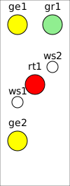

<button>ESTW</button>

<small>[Entwicklung](../develop.md) / [ESTW](estw.md) / [Projektierung](projektierung.md) / Steller</small>

# Stellerprojektierung

<!-- TOC -->

- [Signalsysteme](#signalsysteme)
    - [HL](#hl)
- [Steller](#steller)

<!-- /TOC -->

## Signalsysteme

### HL

## Steller

||HL|KS|HV|
|-|-|-|-|
|rt1|1|1|1|
|rt2|||2|
|ge1|2|2|3|
|ge2|3|5|5|

Autor 

Mathias Rentsch 
rentsch@online.de 
Februar 2026
