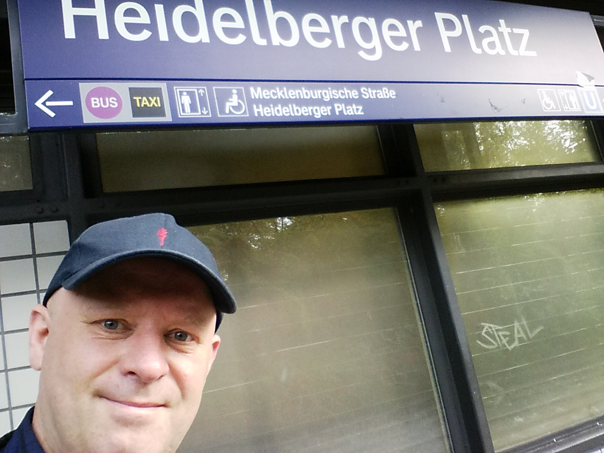
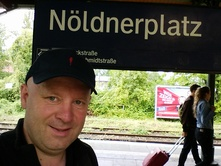
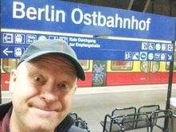
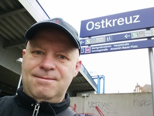
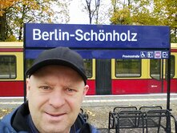
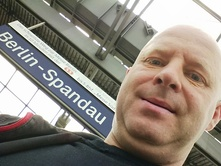
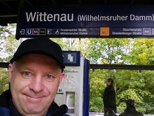
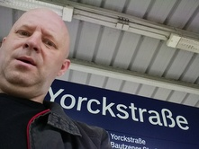
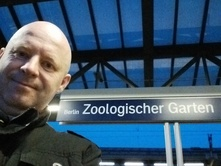

# S-Bahn Berlin

Manche sammeln Briefmarken, ich sammle Bahnhöfe. Berlin hat eines der größten S-Bahn-Netze der Welt – und ich habe es mir zur Aufgabe gemacht, jede einzelne Station persönlich zu besuchen. Die Regel ist simpel: Ein Foto, ein Stationsschild und ich. Von den belebten Bahnsteigen der Ringbahn bis zu den abgelegenen Endstationen tief im Brandenburger Umland. Auf dieser Seite dokumentiere ich meinen Fortschritt auf dem Weg durch das grün-gelbe Herz der Hauptstadt.

<big>Willkommen bei der fotografischen Inventur des Berliner Schienennetzes.</big>

  

    S-Bahn Challenge
    
      <strong>10</strong> von 168 Stationen
    
  

  
  

    

  

Fortschrittsanzeige im farbig markiertem [Netzplan](netzplan.html) der Berliner S-Bahn. Je mehr Stationen ich besuche, desto grüner wird die Karte.

- Idee zum Projekt: 06.04.2026
- Erster Upload: 06.04.2026

<!-- Muster für Bildlinks
|Teststation|S||| -->

|Station|Linien|Datum||
|-|-|-|-|
|Adlershof|S8, S9|||
|Ahrensfelde|S7|||
|Alexanderplatz|S3, S5, S7, S9|||
|Alt-Reinickendorf|S25|||
|Altglienicke|S8, S85|||
|Anhalter Bahnhof|S1, S2, S25, S26|||
|Attilastraße|S2|||
|Babelsberg|S7|||
|Baumschulenweg|S8, S9, S45, S46, S47|||
|Bellevue|S3, S5, S7, S9|||
|Bergfelde|S8|||
|Bernau|S2|||
|Bernau-Friedenstal|S2|||
|Betriebsbahnhof Rummelsburg|S3|||
|Beusselstraße|S41, S42|||
|Biesdorf|S5|||
|Birkenstein|S5|||
|Birkenwerder|S1, S8|||
|Blankenburg|S2, S8|||
|Blankenfelde|S2|||
|Borgsdorf|S1|||
|Bornholmer Straße|S1, S2, S25, S26, S8, S41, S42|||
|Botanischer Garten|S1|||
|Brandenburger Tor|S1, S2, S25, S26|||
|Buch|S2|||
|Buckower Chaussee|S2|||
|Bundesplatz|S41, S42, S46|||
|Charlottenburg|S3, S5, S7, S9|||
|Eichborndamm|S25|||
|Eichwalde|S8, S46|||
|Erkner|S3|||
|Fennpfuhl|S41, S42|||
|Feuerbachstraße|S1|||
|Flughafen Berlin Brandenburg|S9, S45|||
|Frankfurter Allee|S41, S42, S8, S85|||
|Fredersdorf|S5|||
|Friedenau|S1|||
|Friedrichsfelde Ost|S5, S7, S75|||
|Friedrichshagen|S3|||
|Friedrichstraße|S1, S2, S25, S26, S3, S5, S7, S9|||
|Frohnau|S1|||
|Gehrenseestraße|S75|||
|Gesundbrunnen|S1, S2, S25, S26, S41, S42|||
|Greifswalder Straße|S41, S42, S8, S85|||
|Griebnitzsee|S7|||
|Grünau|S8, S9, S46, S85|||
|Grünbergallee|S9, S45|||
|Grunewald|S7|||
|Hackescher Markt|S3, S5, S7, S9|||
|Halensee|S41, S42, S46|||
|Hauptbahnhof|S3, S5, S7, S9|||
|Heerstraße|S3, S9|||
|Hegermühle|S5|||
|Heidelberger Platz|S41, S42, S46|||
|Heiligensee|S25|||
|Henningsdorf|S25|||
|Hermannstraße|S41, S42, S45, S46, S47|||
|Hermsdorf|S1|||
|Hirschgarten|S3|||
|Hohen Neuendorf|S1, S8|||
|Hohenschönhausen|S75|||
|Hohenzollerndamm|S41, S42|||
|Hoppegarten|S5|||
|Humboldthain|S1, S2, S25, S26|||
|Insbrucker Platz|S41, S42, S46|||
|Jannowitzbrücke|S3, S5, S7, S9|||
|Johannisthal|S8, S9, S45, S46, S85|||
|Julius-Leber-Brücke|S1|||
|Jungfernheide|S41, S42|||
|Karl-Bonhoeffer-Nervenklinik|S25|||
|Karow|S2|||
|Kaulsdorf|S3|||
|Köllnische Heide|S41, S42, S45, S46, S47|||
|Köpenick|S3|||
|Königs Wusterhausen|S46|||
|Landsberger Allee|S41, S42, S8, S85|||
|Lankwitz|S25, S26|||
|Lehnitz|S1|||
|Lichtenberg|S3, S5, S7, S75|||
|Lichtenrade|S2|||
|Lichterfelde Ost|S25|||
|Lichterfelde Süd|S25|||
|Lichterfelde West|S1|||
|Mahlow|S2|||
|Mahlsdorf|S5|||
|Marienfelde|S2|||
|Marzahn|S7|||
|Mexikoplatz|S1|||
|Mühlenbeck-Mönchmühle|S8|||
|Neukölln|S41, S42, S45, S46, S47|||
|Nikolassee|S1, S7|||
|Nordbahnhof|S1, S2, S25, S26|||
|Nöldnerplatz|S5, S7, S75|||
|Oberspree|S8|||
|Oranienburger Straße|S1, S2, S25, S26|||
|Oranienburg|S1|||
|Ostbahnhof|S3, S5, S7, S9|||
|Ostkreuz|S3, S5, S7, S75, S8, S85, S9, S41, S42|||
|Pankow|S2, S8|||
|Pankow-Heinersdorf|S2, S8|||
|Potsdam Hauptbahnhof|S7|||
|Prenzlauer Allee|S41, S42, S8, S85|||
|Rahnsdorf|S3|||
|Rathaus Steglitz|S1|||
|Rummelsburg|S3|||
|Savignyplatz|S3, S5, S7, S9|||
|Schlachtensee|S1|||
|Schöneberg|S1|||
|Schöneweide|S8, S9, S45, S46, S47, S85|||
|Schönholz|S1, S25|||
|Spandau|S3, S9|||
|Springpfuhl|S7, S75|||
|Storkower Straße|S41, S42, S8, S85|||
|Strausberg|S5|||
|Strausberg Nord|S5|||
|Südkreuz|S2, S25, S26, S41, S42, S45, S46|||
|Tempelhof|S41, S42|||
|Treptower Park|S41, S42, S8, S9, S85|||
|Wannsee|S1, S7|||
|Warschauer Straße|S3, S5, S7, S9|||
|Westend|S41, S42, S46|||
|Westkreuz|S3, S5, S7, S9, S41, S42|||
|Wittenau|S1, S25|||
|Wollankstraße|S1, S25|||
|Yorckstraße|S2, S25, S26|10.05.2014||
|Yorckstraße (Großgörschenstraße)|S1|||
|Zehlendorf|S1|||
|Zeuthen|S8|||
|Zoologischer Garten|S3, S5, S7, S9|||

## Hinweise

Autor:  
Mathias Rentsch  
rentsch@online.de  
Stand: 08.04.2026  

Für die Erstellung der Karte auf der Seite [netzplan.html](netzplan.html) wurde die Datei [Netzplan neu.svg](https://commons.wikimedia.org/wiki/File:S-Bahn_Berlin_-_Netzplan.svg) von Autor **Arbalete** via Wikipedia/Wikimedia Commons verwendet, die unter [CC BY-SA 4.0](https://creativecommons.org/licenses/by-sa/4.0/) lizenziert ist. Dieses Werk wurde durch die Umwandlung in eine Schwarz-Weiß-Version modifiziert und um farbige Markierungen ergänzt. Gemäß der Lizenz muss dieses bearbeitete Werk unter derselben Lizenz (CC BY-SA 4.0) weitergegeben werden.