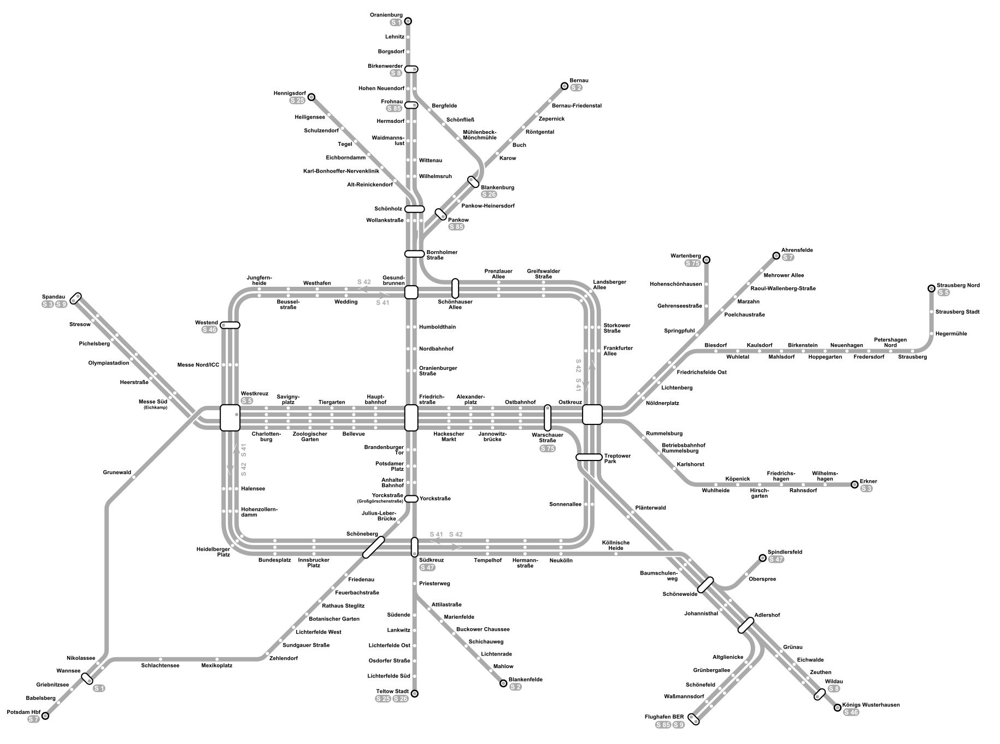
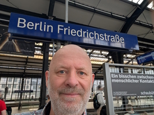
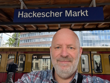
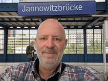
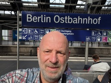
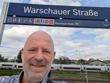

# S-Bahn Berlin

Manche sammeln Briefmarken, ich sammle Bahnhöfe. Berlin hat eines der größten S-Bahn-Netze der Welt – und ich habe es mir zur Aufgabe gemacht, jede einzelne Station persönlich zu besuchen. Die Regel ist simpel: Ein Foto, ein Stationsschild und ich. Von den belebten Bahnsteigen der Ringbahn bis zu den abgelegenen Endstationen tief im Brandenburger Umland. Auf dieser Seite dokumentiere ich meinen Fortschritt auf dem Weg durch das grün-gelbe Herz der Hauptstadt.

<big>Willkommen bei der fotografischen Inventur des Berliner Schienennetzes.</big>

- Idee zum Projekt: 06.04.2026
- Erster Upload: 06.04.2026

  

    S-Bahn Challenge (Stand: 06.05.2026)
    
      <strong>15</strong> von 168 Stationen
    
  

  
  

    

  

Fortschrittsanzeige im farbig markiertem [Netzplan](netzplan.html) der Berliner S-Bahn. Je mehr Stationen ich besuche, desto grüner wird die Karte.

<!-- Muster für erledigte Stationen
###  Alex
S41, S42, S46  
 15.07.1968
-->

### Adlershof
S8, S9

### Ahrensfelde
S7

###  Alexanderplatz
S3, S5, S7, S9  
 05.05.2026

### Alt-Reinickendorf
S25

### Altglienicke
S9, S85

### Anhalter Bahnhof
S1, S2, S25, S26

### Attilastraße
S2

### Babelsberg
S7

### Baumschulenweg
S8, S9, S45, S46, S47

### Bellevue
S3, S5, S7, S9

### Bergfelde
S8

### Bernau
S2

### Bernau-Friedenstal
S2

### Betriebsbahnhof Rummelsburg
S3

### Beusselstraße
S41, S42

### Biesdorf
S5

### Birkenstein
S5

### Birkenwerder
S1, S8

### Blankenburg
S2, S8

### Blankenfelde
S2

### Borgsdorf
S1

### Bornholmer Straße
S1, S2, S8, S25, S26, S41, S42

### Botanischer Garten
S1

### Brandenburger Tor
S1, S2, S25, S26

### Buch
S2

### Buckower Chaussee
S2

### Bundesplatz
S41, S42, S46

### Charlottenburg
S3, S5, S7, S9

### Eichborndamm
S25

### Eichwalde
S8, S46

### Erkner
S3

### Feuerbachstraße
S1

### Flughafen Berlin Brandenburg
S9, S85

### Frankfurter Allee
S8, S41, S42, S85

### Fredersdorf
S5

### Friedenau
S1

### Friedrichsfelde Ost
S5, S7, S75

### Friedrichshagen
S3

###  Friedrichstraße
S1, S2, S3, S5, S7, S9, S25, S26  
 05.05.2026

### Frohnau
S1

### Gehrenseestraße
S75

### Gesundbrunnen
S1, S2, S15, S25, S26, S41, S42

### Greifswalder Straße
S8, S41, S42, S85

### Griebnitzsee
S7

### Grünau
S8, S9, S46, S85

### Grünbergallee
S9, S85

### Grunewald
S7

###  Hackescher Markt
S3, S5, S7, S9  
 05.05.2026

### Halensee
S41, S42, S46

### Hauptbahnhof
S3, S5, S7, S9, S15

### Heerstraße
S3, S9

### Hegermühle
S5

###  Heidelberger Platz
S41, S42, S46  
 13.10.2014

### Heiligensee
S25

### Henningsdorf
S25

### Hermannstraße
S41, S42, S45, S46, S47

### Hermsdorf
S1

### Hirschgarten
S3

### Hohen Neuendorf
S1, S8

### Hohenschönhausen
S75

### Hohenzollerndamm
S41, S42

### Hoppegarten
S5

### Humboldthain
S1, S2, S25, S26

### Insbrucker Platz
S41, S42, S46

###  Jannowitzbrücke
S3, S5, S7, S9  
 05.05.2026

### Johannisthal
S8, S9, S45, S46, S85

### Julius-Leber-Brücke
S1

### Jungfernheide
S41, S42

### Karl-Bonhoeffer-Nervenklinik
S25

### Karlshorst
S3

### Karow
S2

### Kaulsdorf
S3

### Köllnische Heide
S41, S42, S45, S46, S47

### Köpenick
S3

### Königs Wusterhausen
S46

### Landsberger Allee
S8, S41, S42, S85

### Lankwitz
S25, S26

### Lehnitz
S1

### Lichtenberg
S3, S5, S7, S75

### Lichtenrade
S2

### Lichterfelde Ost
S25

### Lichterfelde Süd
S25

### Lichterfelde West
S1

### Mahlow
S2

### Mahlsdorf
S5

### Marienfelde
S2

### Marzahn
S7

### Mehrower Allee
S7

### Messe Nord / ZOB
S41, S42, S46

### Messe Süd (Eichkamp)
S3, S9

### Mexikoplatz
S1

### Mühlenbeck-Mönchmühle
S8

### Neukölln
S41, S42, S45, S46, S47

### Neuenhagen
S5

### Nikolassee
S1, S7

### Nordbahnhof
S1, S2, S25, S26

###  Nöldnerplatz  
S5, S7, S75  
 31.08.2014

### Oberspree
S8

### Olympiastadion
S3, S9

### Oranienburg
S1

### Oranienburger Straße
S1, S2, S25, S26

### Osdorfer Straße
S25, S26

###  Ostbahnhof  
S3, S5, S7, S9  
 15.04.2015  
 05.05.2026

###  Ostkreuz  
S3, S5, S7, S8, S9, S41, S42, S75, S85  
 28.04.2015

### Pankow
S2, S8

### Pankow-Heinersdorf
S2, S8

### Petershagen Nord
S5

### Pichelsberg
S3, S9

### Plänterwald
S8, S9, S85

### Poelchaustraße
S7

### Potsdam Hauptbahnhof
S7

### Potsdamer Platz
S1, S2, S25, S26

### Prenzlauer Allee
S8, S41, S42, S85

### Priesterweg
S2, S25, S26

### Rahnsdorf
S3

### Raoul-Wallenberg-Straße
S7

### Rathaus Steglitz
S1

### Röntgental
S2

### Rummelsburg
S3

### Savignyplatz
S3, S5, S7, S9

### Schichauweg
S2

### Schlachtensee
S1

### Schöneberg
S1, S41, S42, S46

### Schönefeld (bei Berlin)
S9, S85

### Schöneweide
S8, S9, S45, S46, S47, S85

### Schönfließ
S8

### Schönhauser Allee
S8, S41, S42, S85

###  Schönholz  
S1, S25, S85  
 22.10.2015

### Schulzendorf (bei Tegel)
S25

### Sonnenallee
S41, S42

###  Spandau  
S3, S9  
 10.05.2014

### Spindlersfeld
S47

###  Springpfuhl  
S7, S75  
 02.08.2014

### Storkower Straße  
S8, S41, S42, S85

### Strausberg  
S5

### Strausberg Nord
S5

### Strausberg Stadt
S5

### Stresow
S3, S9

### Südende
S25, S26

### Südkreuz
S2, S25, S26, S41, S42, S45, S46

### Sundgauer Straße
S1

### Tegel
S25

### Teltow Stadt
S25

### Tempelhof
S41, S42, S45, S46

### Tiergarten
S3, S5, S7, S9

### Treptower Park
S8, S9, S41, S42, S85

### Waidmannslust
S1, S85

### Wannsee
S1, S7

###  Warschauer Straße
S3, S5, S7, S9  
 05.05.2026

### Wartenberg
S75

### Waßmannsdorf
S9, S85

### Wedding
S15, S41, S42

### Westend
S41, S42, S46

### Westhafen
S41, S42

### Westkreuz
S3, S5, S7, S9, S41, S42, S46

### Wildau
S46

### Wilhelmshagen
S3

### Wilhelmsruh
S1, S85

###  Wittenau  
S1, S85  
 22.10.2015

### Wollankstraße  
S1, S25, S85

### Wuhletal
S5

### Wuhlheide
S3

###  Yorckstraße  
S2, S25, S26  
 10.05.2014

### Yorckstraße (Großgörschenstraße)  
S1

### Zehlendorf  
S1

### Zepernick
S2

### Zeuthen
S8

###  Zoologischer Garten
S3, S5, S7, S9  
 05.05.2014

## Hinweise

Autor:  
Mathias Rentsch  
rentsch@online.de  
Stand: 09.05.2026  

Für die Erstellung der Karte auf der Seite [netzplan.html](netzplan.html) wurde die Datei [Netzplan neu.svg](https://commons.wikimedia.org/wiki/File:S-Bahn_Berlin_-_Netzplan.svg) von Autor **Arbalete** via Wikipedia/Wikimedia Commons verwendet, die unter [CC BY-SA 4.0](https://creativecommons.org/licenses/by-sa/4.0/) lizenziert ist. Dieses Werk wurde durch die Umwandlung in eine Schwarz-Weiß-Version modifiziert und um farbige Markierungen ergänzt. Gemäß der Lizenz muss dieses bearbeitete Werk unter derselben Lizenz (CC BY-SA 4.0) weitergegeben werden.