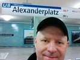
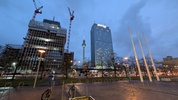
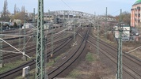

# S-Bahn Berlin

Schöne Bilder

|Station|Linien|Datum||
|-|-|-|-|
|Alexanderplatz|S5, S7, S75|05.04.2026||
|Beusselstraße|S41, S42|||
|Gartenstraße|S41, S42|||
|Günzelstrasse|S41, S42|||
|schoenholz|S41, S42|||
|Westkreuz|S41, S42|||
|Teststation|S|||